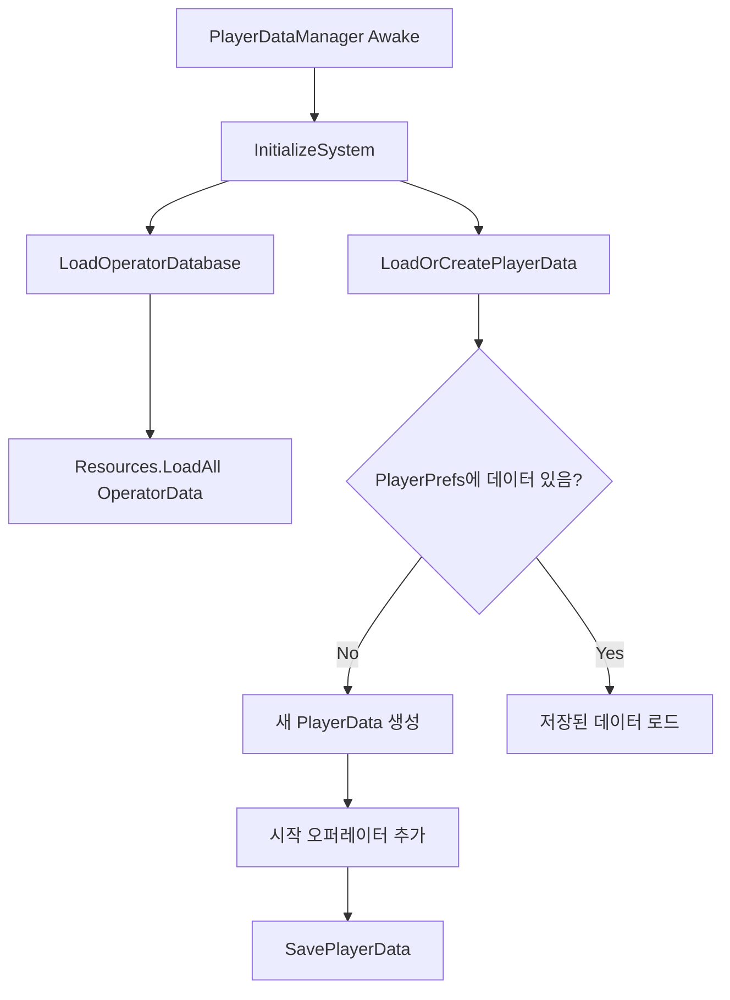

> 1. `LoadOperatorDatabase` : **게임에 있는 모든 `OperatorData` 정보들을 가져옴.** 즉 일종의 도감 역할을 한다.
```cs
    /// <summary>
    /// 현재 게임이 가진 "모든" 오퍼레이터의 정보를 불러온다.
    /// </summary>
    private void LoadOperatorDatabase()
    {
#if UNITY_EDITOR
        string[] guids = UnityEditor.AssetDatabase.FindAssets("t:OperatorData", 
            new[] { "Assets/ScriptableObjects/Operator " }); 

        foreach (string guid in guids)
        {
            string path = UnityEditor.AssetDatabase.GUIDToAssetPath(guid);
            OperatorData opData = UnityEditor.AssetDatabase.LoadAssetAtPath<OperatorData>(path);
            if (opData != null)
            {
                operatorDatabase[opData.entityName] = opData;
                Debug.Log($"Loaded OperatorData: {opData.entityName} from {path}");
            }
        }
#endif
    }
```

## GUID
- `guid = globally unique identifier` - 유니티에서 각 애셋에 할당하는 고유 식별자
	- `.meta` 파일에 저장된다. 
	- 모든 애셋이 고유하고, 다른 폴더로 애셋을 옮겨도 GUID는 유지되며, 버전 관리도 용이하다
- `UnityEditor.AssetDatabase` : 프로젝트의 모든 애셋을 관리하는 시스템
	- 조작이 쉽다 
		- `t:OperatorData` - `OperatorData` 타입
		- `FindAssets("t:OperatorData", new[] { "path" })` : 어떤 경로에 한해서 `OperatorData` 타입들을 찾아라

> 2. `LoadOrCreatePlayerData`

```cs
    private void LoadOrCreatePlayerData()
    {
        string savedData = PlayerPrefs.GetString("PlayerData", "");

        // 저장된 정보가 없는 경우 새로 생성
        if (string.IsNullOrEmpty(savedData))
        {
            playerData = new PlayerData();

            foreach (var op in startingOperators)
            {
                AddOperator(op.entityName);
            }

            SavePlayerData();
        }
        // 저장 정보가 있다면 불러온다
        else
        {
            playerData = JsonUtility.FromJson<PlayerData>(savedData);
        }
    }
```
> - `PlayerPrefs`에서 플레이어의 보유 오퍼레이터 정보를 로드한다. 

여기서 
```cs
string savedData = PlayerPrefs.GetString("PlayerData", "");
```
> - 이 부분은 `Unity.PlayerPrefs`로, 로컬에 저장된 데이터를 문자열로 가져온다.
> - `PlayerData`라는 키로 저장된 값을 조회하고, 없으면 빈 문자열을 반환한다.

참고로 저장은
```cs
private void SavePlayerData()
{
	string jsonData = JsonUtility.ToJson(playerData);
	PlayerPrefs.SetString("PlayerData", jsonData);
	PlayerPrefs.Save();
}
```

## PlayerPrefs
- `PlayerPrefs`
	- 플레이어의 진행 상황, 설정 등 변경 가능한 데이터를 저장한다.
	- 운영 체제의 레지스트리나 `.plist` 파일 등에 이용된다.
	- 게임을 종료해도 데이터가 유지된다.
	- 저장 위치는 플랫폼 별로 달라지며, 따로 접근하는 건 까다로운 경우가 많음
	- 주의 사항
		- 암호화되지 않은 상태로 저장된다. 중요한 데이터는 서버에 저장하거나 암호화해야 함.
		- 앱 삭제 시 함께 삭제된다.
		- 모바일의 경우, 앱의 캐시/데이터 삭제 시에도 삭제된다.
	- 따라서 주로 아래의 상황에서 `PlayerPrefs`을 사용한다.
		- **게임 설정(소리, 그래픽 등)**
		- **게임 진행 상황**
		- **비중요 데이터**