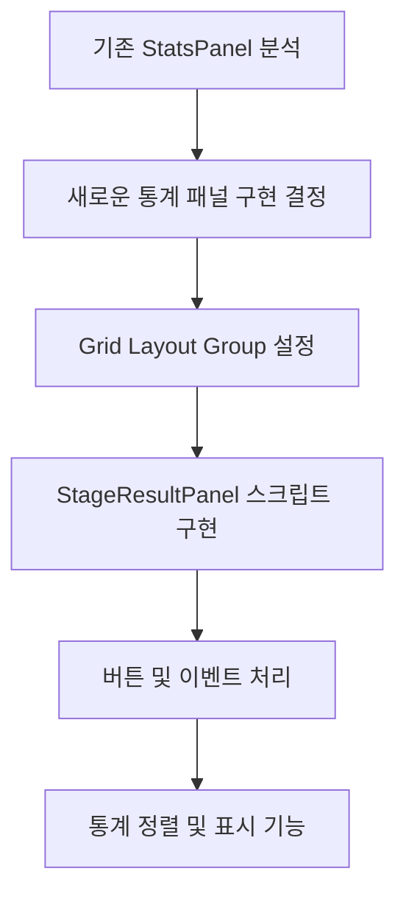

오늘의 대화를 정리하겠습니다:

1. 최초 목표 설정:
- 스테이지 클리어 패널에 통계값 표시
- 패널/씬 전환 부드럽게 연결
- 로딩 화면 및 전환 효과 구현

2. 첫 번째 목표(통계값 표시) 구현 과정:

3. 주요 기술적 논의:
- 패널 vs 새 스크립트 결정 (단일 책임 원칙)
- Grid Layout Group 배치 방식
- UI 요소 정렬 및 레이아웃
- 버튼 이벤트 처리 및 전파
- 통계 데이터 정렬 및 표시

4. 해결한 주요 이슈들:
- UI 이벤트 전파 제어
- 통계 패널 클릭 처리
- 버튼 색상 상태 관리
- 통계 데이터 동적 정렬

5. 최종 구현된 기능:
- 통계 타입별 데이터 표시
- 절대값/퍼센트 전환
- 동적 데이터 정렬
- 버튼 상태 시각화
- 클릭 이벤트 제어

아직 남은 작업:
- 로딩 화면 구현
- 전환 애니메이션 효과
- 패널 간 부드러운 전환

각 단계에서 코드의 품질과 사용자 경험을 고려하며 구현했습니다.