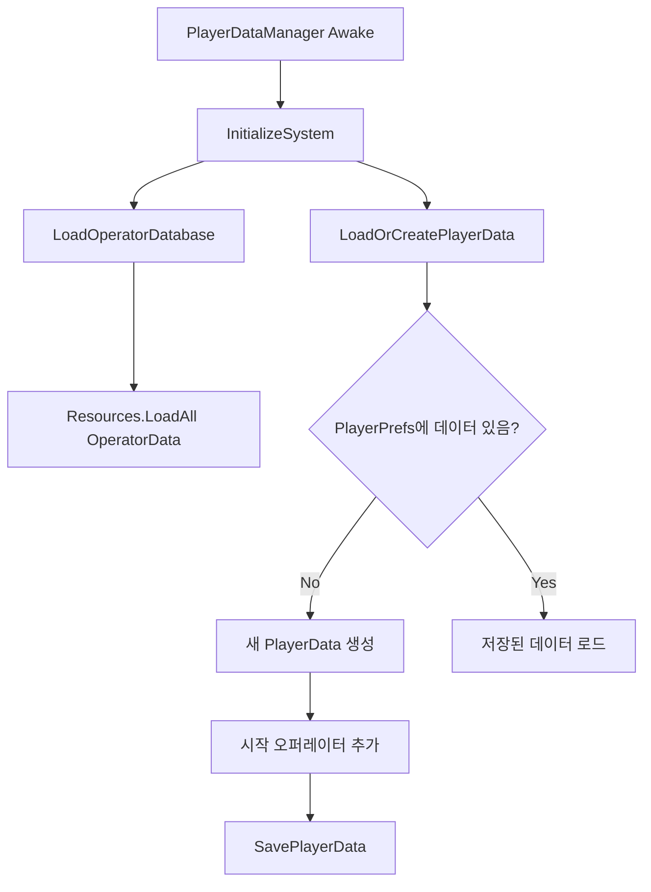

# 앞으로 구현할 거 정리

## 유사 명방
- 게임적인 목표
	- 스테이지 : `1-1 ~ 1-3` 까지 구현하기
	- **최소 8명**의 오퍼레이터 구현 (스킬도 일단은 1개씩만 구현)
- 시스템 관련
	- `DeployableManager`에서 받는 오퍼레이터들의 정보는, 이전 씬에서 가져와야 함(이를 `편성 씬`이라고 하자)
		- 추가로 그 스테이지에서만 쓸 수 있는 요소가 있다면 그것도 추가해서 최종적으로 `BottomPanel`에 모두 나타나도록 해야 함
	- 육성 요소 추가
		- 스테이지를 저런 식으로 구현할 거면, `레벨업 재화`를 1-1 시작 전에 얼마를 주고, 스테이지를 클리어할 때마다 `레벨업 재화`를 오퍼레이터에게 사용해서 육성을 시키게끔 구현하는 것도 괜찮을 듯(어떤 오퍼레이터에게 사용할지는 유저가 정하는 방식, **한정된 재화를 어떻게 사용할 것인가?**)
		- 오퍼레이터가 특정 레벨에 도달하면 재능(패시브)을 얻게 하거나 또다른 액티브 스킬을 얻게 하는 방식도 넣어볼 만 하겠다.


## 블로그
- 데이터가 제때 수집되고 있는지 눈팅 정도만 하면 충분할 것 같다.
- 사실 Quill을 쓰면서 되돌리기 / 붙여넣기 기능이 좀 이상하게 작동하고 있는 문제가 있긴 한데... 언제 해결할지는 모르겠음?
- **데이터 수집기에서 외부 주소 못 읽는 문제 발생 시작(`241001 ~ `).** 이걸 해결할 수가 있나?

## 작업 예정

### 유사 명방(전체)
- 다 완료됐다면 그 다음에 구현할 것
	- 스킬
	- 캐릭터 스프라이트
	- 육성 : 오퍼레이터의 레벨
	- 편성 씬
	- 이 다음엔 스테이지 1-1 ~ 1-3 구현

> 지식이 늘었다) 3D 프로젝트 위에 2D 오브젝트들을 작동시키려면 `Quad(평판)` Mesh Filter를 만들고 Mesh Renderer의 머티리얼에 2D로 그릴 것들을 올리면 됨

- **발생 중인 이슈**

- 간헐적인 문제
	- `Barricade`를 부수는 경우에, 어떤 상황에서는 렉이 갑자기 심해지는 증상이 있다. 이게 컴퓨터의 이슈인지 경로 설정 로직의 이슈인지는 모르겠음.
		- 특정 상황이 아니라, 왜인지 모르게 렉이 심해지는 타이밍이 있다. 무엇이 원인인지는 모르겠음.
	-  `Enemy` 기준, 바리케이드 파괴 로직이 동작하지 않는 현상이 있음

> - `StageData`의 `Spawner`들 관리하는 거
> - 다른 패널들 구현하는 거
> - 패널 전환 시 애니메이션 등등

- (X)`SquadEditPanel`에서 스테이지 진입하는 로직 구현
- (X) (이건 나중) 저기서 `LeftArea`의 하단 부분은 나중에 스킬 등록하는 부분으로 만들 거임
# 11월

## 241107
### 짭명방
#### 메인메뉴 씬 구현
- 발견한 점들
	- `SquadEditPanel`
	 1) 오퍼레이터가 배치될 때 `OperatorSlotButton`의 UI가 흐트러지는 현상 있음
	 - `OperatorListPanel`
	 1) 이미 스쿼드에 편성된 `Operator`는 나타나지 않게 해야 함

일단 `MainMenuManager`에서 스쿼드를 편성하는 기능은 기존에 `StageScene`에 존재했던 `UserSquadManager`로 옮겼음. `MainMenuManager`는 단순히 `UserSquadManager`에 있는 `CurrentSquad`를 체크해서 스테이지 시작 여부만 결정함

- 고민
	- `SquadEditPanel`에서 특정 슬롯 버튼을 선택 -> 패널 전환 -> `OperatorListPanel`에서 오퍼레이터 선택 후 확인 -> `SquadEditPanel`의 특정 슬롯 버튼에 오퍼레이터 할당
	- 여기서 "특정 슬롯 버튼"이라는 정보를 패널 전환 과정에서 유지하고 있어야 하는데(비활성화 때문에), 이걸 `SquadEditPanel`에서 할지 더 상위 오브젝트인 `MainMenuManager`에서 할지 모르겠다. 아니면 비활성화를 안 쓰는 방법도 있겠다.
		- **`UserSquadManager`에서 `currentSquad` 정보를 갖게 하는 방법이 좋을 것 같음.** 편집 중이거나 할 때도 여기서 인덱스를 관리하면 될 것 같다.
	- 하나씩 해나가면 되는데 자꾸 "이런 상황은 어떡하지 저런 상황은 어떡하지"가 떠올라서 진행을 제대로 못하고 있다 ㅋㅋ
		- 예를 들면 여기서도 `협약` 같은 편성 수가 제한되는 상황에서는 스쿼드를 어떻게 처리할까? 같은 게 떠오름 
			- 이런 것도 사실 유저가 갖고 있는 스쿼드를 불러온 다음 협약의 제약 조건에 따라 인덱스 상 뒤에 위치한 오퍼레이터들을 쳐내는 식으로 구현이 될 것 같음.
	- 어쨌든 저런 상황은 제외하고 진행한다.  일단은 **기능을 하는 것들을 만드는 게 우선**이다. 최적화나 별도의 상황은 나중에 할 일이다. `협약` 만들 것도 아니니까.

>1. `UserSquadManager`에서 `currentSquad`를 담당함. 최초 생성이나 업데이트 등등..
>2.  `SquadEditPanel`에서는 `currentSquad`에 따른 UI 업데이트를 담당함. 어떤 슬롯을 선택하면 해당 슬롯의 인덱스는 `UserSquadManager`에서 갖고 있음
>3.  `OperatorListPanel`에서 오퍼레이터를 선택하면 `SquadEditPanel`로 돌아오면서 해당 슬롯에 오퍼레이터가 할당됨.

추가 이슈) `SquadEditPanel`에서 오퍼레이터가 할당된 다음 UI 구조가 깨지는 이슈가 있음 
- 프리팹 이슈. 수정했음.
추추가 이슈) `OperatorListPanel`이 게임 실행 전에 비활성화된 경우 게임 실행 시에 활성화되지 못함 
- 이게 조금 특이하다. [[Unity - gameObject의 활성화 관련]] 
	- **유니티에서 비활성화된 오브젝트는 메모리에 스크립트를 올려두지만, 실행은 활성화됐을 때 이뤄진다.** 
	- 그런데 지금 상황은 `Awake` 메서드에 다시 비활성화시키는 코드가 있기 때문에 발생했음.
	- 관련해서 [[Unity - 생명 주기 메서드]] 참고.


## 241106
[[241106]]
### 짭명방

#### 메인메뉴 씬 구현
- `OperatorSelectionPanel` 구현 중
![[Pasted image 20241106115147.png]]
> 어제 하던 아이콘 작업 마무리 (적당히 재탕한 요소들도 있음)
- 이 부분(`StatInfoCard`)에 현재 선택된 오퍼레이터가 가진 수치 넣기
	- 스택 오버플로우 에러가 떴었다. 오퍼레이터를  클릭한 상태일 때, 같은 슬롯을 클릭한 상태라면 바로 `return`을 하도록 수정하면 해결.
- 공격 범위 구현하기 (`0, 0`이 오퍼레이터 위치, 우측을 바라보도록)

- 영역 네이밍 규칙 정하기
```
panel
- area
	- Container
		- card
			- group
```

- 오퍼레이터 클릭 시 범위 시각화 구현까지 진행했음
```cs
private void CreateRangeTile(Vector2Int gridPos, bool isCenterTile)
{
	// 프리팹 선택
	Image tilePrefab = isCenterTile ? filledTilePrefab : outlineTilePrefab;

	// 타일 생성
	Image tile = Instantiate(tilePrefab, attackRangeContainer);

	// 위치 개념 설정 -  사실상 gridPos 값에 (tileSize  + 1.5) 곱한 거랑 동일함
	tileSize = tile.rectTransform.rect.width;
	float interval = tileSize / 4f; 
	float gridX = gridPos.x * tileSize + gridPos.x * interval;
	float gridY = gridPos.y * tileSize + gridPos.y * interval;

	// 위치 설정 : 오프셋 반영
	tile.rectTransform.anchoredPosition = new Vector2(
		gridX - centerPositionOffset,
		gridY
	);

	rangeTiles.Add(tile);
}
```
![[Pasted image 20241106160616.png]]
![[Pasted image 20241106160628.png]]
> 이렇게 보니까 선택창이 이름 가리는 게 불-편하다. 스프라이트를 만들 때 정사각형 비율로 사용하지 않을 것 같으면 처음부터 도화지 사이즈를 그렇게 만들어서 작업해야할 것 같음
> - 근데 간단한 해결법은 저 `SelectedIndicator`를 `OperatorSlotButton`보다 크게 만드는 거임!

- 일단 멈추면서 다음에 뭐할지 생각해보면
	- (O)하단에 좌우 슬라이드 구현하기
		- [[스크롤 영역 구현하기]]
		- 추가로 현재 보유한 오퍼레이터의 수에 따라 `content`에 해당하는 `OperatorSlotContainer`의 너비값을 동적으로 변화시키도록 구성한다. 
		- 특정 너비로 디폴트값을 정하고 오퍼레이터의 수가 증가함에 따라 추가하는 개념으로 구현
	- (O)나타나는 `OperatorSlotButton` 들 왼쪽으로 정렬시키고
	- (△)`ClassIcon`은 `LeftArea`랑 `OperatorSlotButton` 모두에 나타나게 하고
		- `LeftArea`에는 X, `OperatorSlotButton`에만 나타나게 함. 이 과정에서 `MainMenuManager`에 `IconHelper`의 `IconData`를 초기화하는 로직 추가.
- [[화면 너비 비율 1대3 맞추기]]
## 241105
[[241105]]
### 짭명방

#### 메인메뉴 씬 구현
- 어제 안 됐던 것 수정
```cs
KeyNotFoundException: The given key 'BaseVanguard' was not present in the dictionary.
```
원본 코드, 즉 OperatorData들이 저장된 폴더가 `Assets/ScriptableObjects/Operator` 였는데 이 경로를 쓸 때 `"Operator "`로 써서 이슈가 된 것으로 보인다. 후,,,,,,,

- `OperatorSelectionPanel`에서 선택된 슬롯에 대한 시각화가 제대로 나타나지 않는 현상 수정
- `OperatorSlotButton` 스크립트 정리

> 해결해야 할 것
> - `ClassIcon`, `SkillIcon`이 비활성화되는 현상
> - `ClassIcon`에 클래스 보이게 하기
> - `OperatorSelectionPanel` 좌측에 현재 선택중인 오퍼레이터의 간략한 정보 보이게 하기

- 가장 마지막 진행 중 / 2번째는 해결 X

## 241104
[[241104]]
### 짭명방

#### 메인메뉴 씬 구현
- 기존 메인 메뉴 정보 정리 - `PanelInfo, MenuPanel` 정의 및 패널들 교통 정리
	- [[Unity - 버튼에 리스너 할당하기]]
	- [[Unity - 이벤트]]
		- 갑자기 헷갈리기 시작해서 정리. **쉽게 정리하면 `event.Invoke(param)`에서 파라미터를 정했다면 이를 `event.AddListener(method)`로 등록할 때 `method`는 `Invoke`가 가진 파라미터 `param`을 똑같이 따라가야 함.**
	- 일단 기존의 패널들을 `PanelInfo (type, panel)`로 바꾸고 `MenuPanel`을 `enum` 타입으로 정의해서 `type`에 넣고 있음
		- 패널 추가에 더 용이하고
		- 메서드 구현도 더 원활하고. 그래서 기존 메서드도 수정했다..
		- 이 때 **`enum`타입의 0번은 `None`을 사용**하는 게 좋아보인다. `enum` 타입의 변수에 아무것도 할당하지 않으면 가장 위의 것으로 초기화되는데, 이게 거슬릴 때가 있음. `아무 것도 할당하지 않음`을 나타내는 변수가 있는 게 좋다.
			- 이거 이쁘게 해결한다고 시간을 좀 썼다.

- `OperatorSelectionPanel` 만들기
	- 일단 `보유한 오퍼레이터`를 관리하는 방법부터 시작
		- 이런 정보 관리는 정말 아예 모르기 때문에 이것부터 잘 알아두면서 진행하겠음
	- `보유한 오퍼레이터`들을 `OperatorSlotButton`들로 쫙 보여주고 그 중 하나를 선택해서 `OperatorSlot`에 배치할 수 있음
	- 여기서 스킬 선택도 같이 이뤄짐

- 보유한 오퍼레이터 관리하기

- [[보유 오퍼레이터 관리하는 로직]]
	- [[보유 오퍼레이터 관리하는 로직#GUID]]
	- [[보유 오퍼레이터 관리하는 로직#PlayerPrefs]]


## 241102

### 짭명방
[[241102]]
#### 메인 메뉴 씬 구현
- `SquadEditPanel` : 스테이지 진입 전의 편성창
- `OperatorSelectionPanel` : `SquadEditPanel`의 각 박스를 클릭하면 해당 박스에 들어갈 오퍼레이터를 선택할 수 있음

- `OperatorSlotButton`을 구현, `ButtonContainer`에 총 14개의 버튼을 넣음
	- 컨테이너에 `Grid Layout Group`이라는 컴포넌트가 있음. 이걸 이용하면 쉽게 그리드를 짤 수 있다.
- 버튼들의 관리나 동작은 `SquadEditPanel`에서 진행한다

> - 각 버튼을 클릭했을 때의 동작을 아직 설정하진 않은 상태. 전체적인 레이아웃만 아래와 같다
> - 즉 왼쪽의 `Empty Slot`을 클릭했을 때의 오퍼레이터 선택 패널로 전환하는 거나, `Enter Stage`를 클릭했을 때 스테이지로 돌입하는 과정 등은 아직 구현되지 않은 상태임

![[Pasted image 20241102161529.png]]
![[Pasted image 20241102161819.png]]
## 241101
[[241101]]
### 짭명방

#### 메인 메뉴 씬 구현
- 일단 화면 전환 같은 거는 그냥 어떤 화면 띄울지 매니저에서 관리하거나 버튼으로 나타나고 사라지게 하면 되는 느낌이라 크게 상관 없는데
- 여기서 고민이 되는 건 Stage들을 어떻게 관리하느냐다. 
	- 모든 스테이지를 개별 씬으로 관리하느냐?
	- 하나의 씬으로 처리하고 별개의 맵을 불러오는 방식으로 처리하느냐?

... 이런 점에서 고민이 생겼다. 기존에 스테이지에서 작업할 때는 맵만 별도로 불러오는 방식을 생각했었음.

- 일단 접근 자체는 이렇게 하겠음
- 스테이지 선택 패널
	- `StageButton`에 `StageData` 추가
	- `StageData`는 해당 스테이지의 이름, 설명, 불러올 맵 프리팹 등을 저장
	- `StageButton` 클릭 시 `StageData`에 있는 정보들을 오른쪽에 보여줌, 이 정보들을 유지한 상태로 다음으로 넘어가는 방식

- 일단 기본적인 스테이지 선택 패널 로직은 구현해놨음
	- **`StageButton` 자체가 클릭되었다라는 거는 버튼 단위(`StageButton.cs`)에서 관리하고, 현재 선택된 버튼을 관리하는 건 상위 오브젝트에서 관리함**
	- 이거 헷갈려서 오늘 하루죙일 헤맸다.. 

> 앞으로 할 거라면
> - `StageData`의 `Spawner`들 관리하는 거
> - 다른 패널들 구현하는 거
> - 패널 전환 시 애니메이션 등등


