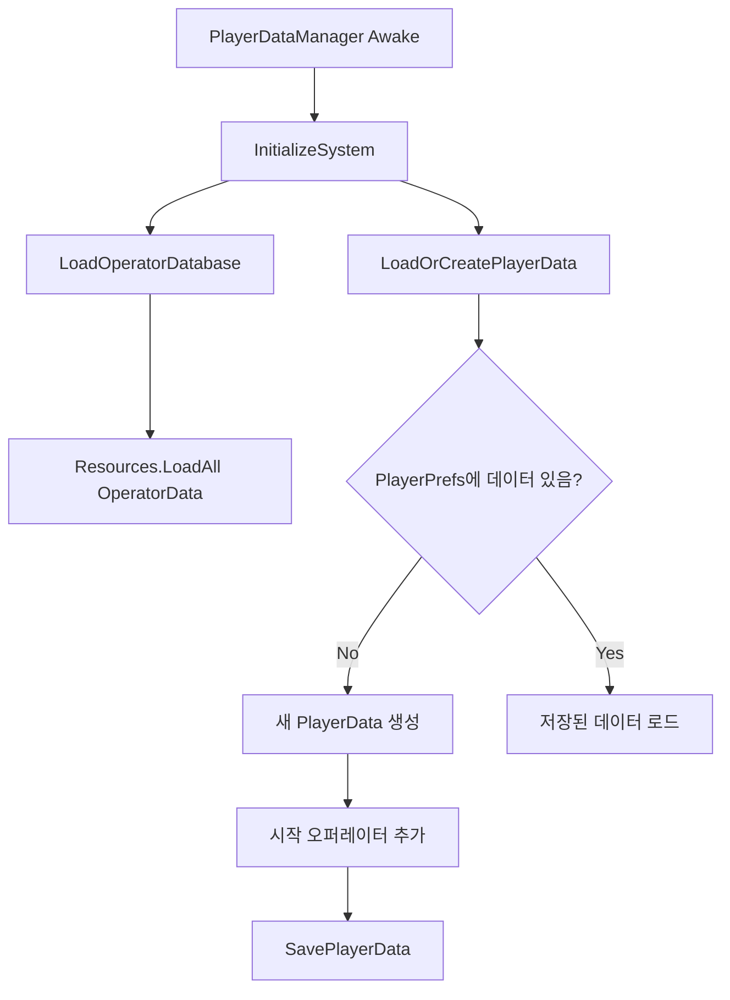

## 블로그
- 데이터가 제때 수집되고 있는지 눈팅 정도만 하면 충분할 것 같다.
- 사실 Quill을 쓰면서 되돌리기 / 붙여넣기 기능이 좀 이상하게 작동하고 있는 문제가 있긴 한데... 언제 해결할지는 모르겠음?
- **데이터 수집기에서 외부 주소 못 읽는 문제 발생 시작(`241001 ~ `).** 이걸 해결할 수가 있나?

## 작업 예정

### 유사 명방(전체)
#### 구현 예정
- 스킬 (오퍼레이터마다 2개씩)
- 캐릭터 스프라이트
- 육성 : 오퍼레이터의 레벨
- 이 다음엔 스테이지 1-1 ~ 1-3 구현
> - `OperatorSelectPanel.LeftArea`의 하단 부분은 나중에 스킬 등록하는 부분으로 만들 거임

#### 발생 중인 이슈

> 발견한 남은 문제


- `StageData`의 `Spawner`들 관리하는 거
- 도서관에서 책 빌려온 김에 VFX로 스킬 이펙트 만들어보기

- 간헐적인 문제
	- `Barricade`를 부수는 경우에, 어떤 상황에서는 렉이 갑자기 심해지는 증상이 있다. 이게 컴퓨터의 이슈인지 경로 설정 로직의 이슈인지는 모르겠음.
		- 특정 상황이 아니라, 왜인지 모르게 렉이 심해지는 타이밍이 있다. 무엇이 원인인지는 모르겠음.
	-  `Enemy` 기준, 바리케이드 파괴 로직이 동작하지 않는 현상이 있음

# 11월

## 241119
[[241119]]
### 짭명빵

#### 씬 전환 관련 정보들 정리 
- 스테이지 클리어 후에 메인 메뉴로 돌아왔을 때 버튼이 동작하지 않는 현상이 있음
	- 씬 전환 시에
		- 기존 씬의 모든 `GameObject`들은 파괴, 컴포넌트도 같이 파괴된다.
		- 모든 변수들도 초기화된다.
		- 단, `DontDestroyOnLoad(gameObject)`가 있다면 파괴되진 않는다. 
	- 근데 돌아오고 나서 보면 `MainMenuScene`에 `DeployableBox`들이 생성되어 있음(???)

- `GameManagement`에 `ResourceManager`를 추가, `IconData` 같은 스테이지 씬과 메인메뉴 씬에서 공통으로 관리되는 요소를 여기에 다 넣음
	- `UIManager, MainMenuManager`의 `IconHelper` 초기화 로직을 `ResourceManager`로 옮김

-  ?????????????? 아래 문제를 해결하다 보니까 위에 문제도 해결됐다. 뭐지?
	- 살펴보면 두 씬 모두에서 유지되는 `GameManagement`에 `OnSceneLoaded`에서 `Time.timeScale` 값에 따른 것으로 보임
```cs
public void OnSceneLoaded(UnityEngine.SceneManagement.Scene scene, LoadSceneMode mode)
{
	Time.timeScale = 1f;
}
```
> 이거 주석처리하면 메인메뉴 씬에서 편성 창으로 넘어가려고 해도 넘어가지지 않음

---

- 메인 메뉴로 돌아온 뒤(2성 이하)에 해당 스테이지가 클릭된 상태로 나타나게 하려고 했는데, 클릭은 된 상태인데 `StageDetail` 패널이 나타나지 않는 상태이다. 
- 일단 1시간 정도 두드리면서 추측해보건데
	- `MainMenuManager.SetLastPlayedStage` 의 모든 메서드들은 정상적으로 실행되는 것 같음
	- 그러면 `StageSelectPanel`에서 위 메서드에 의한 활성화가 되었다가, `Start()` 메서드에서 다시 비활성화되는 것 같다. (해당 패널이 `null` 로 나타나지 않기 때문에)

- **`MainMenuManager`에서 각 패널들의 초기상태를 지시하도록 하고, 각 패널들은 해당 지시를 받아서 UI를 나타내는 역할만 시키면 된다.** 이 구조를 떠올리는 게 생각보다 어렵다; 
	- 그냥 `MainMenuManager`에서 변수 하나 놓고 나머지 패널들이 그 변수를 참조하게 하면 된다. 이러면 생명 주기가 꼬이지도 않는다. 그 변수는 고정됐으니까.

---
#### StageResultPanel
- `StatisticItem`이 초기화될 때, 혼자 모든 값을 차지함에도 게이지의 중간까지만 나타나는 현상 수정
- 마찬가지로 패널이 초기화될 때 `DamageDealt` 버튼이 활성화된 채 보이도록 수정

## 241118
[[241118]]
### 짭명방 

#### GameWinPanel 수정
- 이전엔 게임 클리어 시 패널이 바로 나타나고, 이를 클릭하면 사라지도록 구성했음
- 이번엔 게임 클리어 시 애니메이션을 이용해 패널이 지나간 다음 결과 화면으로 이어지도록 수정했다.
- [[Unity - DOTween]] (오늘 사용한 애니메이션 효과만 간단하게 정리)
- 오늘의 팁) `DOTween`의 애니메이션 시퀀스는 기본적으로 `Time.timeScale`을 따른다. 이를 방지하려면 시퀀스에 `SetUpdate(true)`를 넣으면 된다.
```cs
DOTween.Sequence().SetUpdate(true);
```
> 저 파라미터가 `bool isIndependentUpdate`임. 유니티의 타임스케일과 독립적으로 동작할까를 결정한다.
- 로고도 대충 막 그려서 하나 추가함
#### StageResultPanel 수정
- 결과 패널을 보여줄 때 한꺼번에 모든 정보를 보여주는 게 아니라 애니메이션을 추가해서 정보를 보여주는 걸 구현해본다

- 일단 Star 애니메이션과 반짝이는 효과 추가
```
해당 Star에 불이 들어오지 않는 경우는 StageClearStar 스프라이트 및 회색(HSV 기준 0, 0, 40)으로 구현

해당 Star에 불이 들어오는 경우는 애니메이션과 함께 StageClearStarGlow 스프라이트 및 시안색으로 구현
```

- 애니메이션이 끝나고 다음 Star로 넘어가서 다시 진행이 돼야 하는데, 0번 인덱스만 진행되고 더 이상 진행이 안된다. ?? 오류도 안뜨고 디버깅해도 뭔질 모르겠네
- 메서드 마지막에 있던 이 부분이 문제였다. 주석처리하니까 의도한 대로 잘 동작함.
```cs
            //if (currentIndex < resultData.StarCount - 1)
            //{
            //    Debug.Log($"Waiting delay before star {currentIndex + 1}");
            //    yield return new WaitForSeconds(starActivationDelay);
            //}
```

- 왜 문제인가 감이 안 잡히다가 저 `WaitForSeconds`에 커서를 올려보니까 대충 알겠더라 : **`Time.timeScale = 0`일 때 저 `WaitForSeconds`에도 영향을 준다.** 그래서 다음 인덱스로 넘어가지를 못했던 것.
	- `WaitForSecondsRealtime`이라는 클래스가 또 있다. 얘를 적용해보면 다음 애니메이션도 잘 동작함!


## 241115
[[241115]]
### 짭명방

#### 로딩 화면 구현
- `LoadingScreen`이라는, 두 씬에 종속되지 않는 별도의 프리팹을 만든다. 
- 구현 완료. **패널이 완전히 사라진 다음에 스테이지가 시작하도록 스테이지 시작 타이밍을 수정했다.**
	- 이럴 때 사용할 수 있는게 `IEnumerator` 반환 타입을 갖는 메서드에서 쓸 수 있는 `WaitUntil(method)`이다. 
		- `method` 내의 조건이 `true`가 될 때까지 코루틴을 일시 중지하는 유니티의 기능이다. 
	- 오퍼레이터 코스트가 회복되는  로직도 `Prepare`에 있었는데 `Battle`로 옮겼다.

- 디테일은 재끼고 간단하게 설명하면
1. `StageLoader` 에서 `StageManager.PrepareStage`를 동작시킴
2. `PrepareStage`에서 모든 동작을 마친 뒤 마지막에 준비 완료 이벤트를 발생시킴
3. 준비 완료 이벤트가 발생하면 (스테이지매니저 인스턴스가 생긴 시점에 구독한) `StageLoadingScreen`에서 보고 있다가 페이드 아웃을 발생시킴
4. 페이드아웃이 끝난 뒤에 페이드 아웃이 끝났음을 알리는 이벤트를 발생시킴
5. `StageLoader`에서 페이드 아웃이 끝난 걸 파악하면 `StartStage`를 진행시킴


#### 기타 문제 해결
> `SquadEditPanel` : 이전에 할당된 적 있는 `OperatorSlot`을 빈 공간으로 만들었을 때 최초부터 빈 공간이었던 `OperatorSlot`과 색깔 차이가 남. 
- 이거 때문에 그랬다.
```cs
    private void UpdateVisuals()
    {
        if (!isThisActiveButton)
        {
            // 비활성 슬롯 표시
            SetInactiveSlotVisuals();
            return;
        }

        if (AssignedOperator == null)
        {
            // 빈 슬롯 표시
            SetEmptySlotVisuals();
            return;
        }

        // 오퍼레이터가 할당된 슬롯 표시
        SetOperatorSlotVisuals();

        // 선택 상태 표시
        UpdateSelectionIndicator();

        // 버튼 색상 업데이트
        UpdateButtonColor();
    }
```
> 여기서 `UpdateButtonColor()`가 버튼의 색을 업데이트하는데, 빈 슬롯 / 비활성화된 슬롯은 `UpdateButtonColor()`를 실행시키지 않는 문제가 있음. 따라서 저 2개의 조건문 내에 `UpdateButtonColor()`를 넣어주면 됨.


## 241114

### 짭명방 
#### StageResultPanel 수정
- `ResultStatsPanel`을 클릭/터치할 때는 동작하지 않도록 수정
```cs
    private bool IsClickableElement(GameObject targetObj)
    {
        if (!EventSystem.current.IsPointerOverGameObject()) return false;

        PointerEventData pointerData = new PointerEventData(EventSystem.current);
        pointerData.position = Input.mousePosition;
        List<RaycastResult> results = new List<RaycastResult>();
        EventSystem.current.RaycastAll(pointerData, results);

        foreach (var result in results)
        {
            // 클릭된 객체가 통계 패널이나 그 자식인지 확인
            Transform current = result.gameObject.transform;
            while (current != null)
            {
                if (current.gameObject == targetObj)
                {
                    return true;
                }
                current = current.parent;
            }    
        }
        return false;
    }
```
> 비슷한 걸 스크립트에 넣은 기억이 있는데 어디에 있는지가 기억나지 않는다. 

#### 패널 / 씬 전환 더 디테일하게 구현
- 일단 메인 메뉴에 있는 각 `Panel`들에 `Canvas Group`을 추가, 이들 단위로 애니메이션이 동작하게 했다.
- `DOFade`을 이용해 한 패널에서 다른 패널로 전환할 때 두 패널에 동시에 페이드를 적용했는데, 중간에 아무 것도 없는 빈 배경이 나오는 시간이 있다. 
	- 명방을 보면 약간 위계가 있는 느낌임
		- 메인 패널 -> 스테이지 선택 패널 진입 시 스테이지 선택 패널이 페이드 인 후 메인 패널 비활성화(추정)
		- 스테이지 선택 패널 -> 메인 패널 진입 시 메인 패널 활성화 후 스테이지 선택 패널이 페이드 아웃 
	- 지금 상황의 경우 패널이 많이 없기 때문에 비슷한 느낌으로 가도 될 것 같다
		- 패널 전환 메서드를 구현해놓고, 2개의 게임 오브젝트를 받는다는 느낌으로?

#### OperatorListPanel - SetEmpty 버튼 구현
- 쉽게 구현할 수 있을 줄 알았으나.. `GameManagement.UserSquadManager`와 연동해서 생각해야 함
	- 또 `OperatorListPanel` 자체가 `Grid Layout`을  사용하고 있어서 빈 공간이 있으면 냅두는 게 아니라 채운다. 이게 인덱스와 충돌하기도 한다.
	- 디버깅해보면 `Grid Layout`의 인덱스는 예상했던 대로 잘 들어간다(좌측 상단부터 아래로 01 / 23 / 45 ... 이런 식으로 채우는 방식임)
	- 그런데 `Grid Layout` 자체가 내용물이 채워진 인덱스는 앞으로 보내는 방식을 취하고 있음.
		- 예를 들어 스쿼드의 0번과 5번에 오퍼레이터를 배치하더라도 UI 상에서는 0번과 1번에 오퍼레이터가 나타나는 방식임. 1번 슬롯을 클릭하고 비우려고 해도 비워지지 않는다. 5번 슬롯을 클릭해야 비워진다.

> 이거 문제 원인은 아래와 같다.
```cs
public List<OperatorData> GetCurrentSquad()
{
	return currentSquad.Where(op => op != null).ToList();
}
```
- 여기서 **null인 것들을 모두 쳐내니까 길이가 줄어든 리스트가 반환되고 이를 기반으로 UI를 만들었기 때문에 그리드가 정리되는 것처럼 보인 것**이다.
- 따라서, 해당 부분은 아래처럼 수정이 됐다.
```cs
return new List<OperatorData>(currentSquad);
```

그런데 `GetCurrentSquad`의 경우 다른 상황에서도 쓰였다. `currentSquad`는 초기화할 때 사용 가능한 갯수의 길이를 갖고 빈 곳은 `null`을 넣었는데, 이 `null`값으로 인해 오류가 발생하는 경우가 있다. 따라서 이런 경우는 `UserSquadManager`에 별도의 메서드를 구현해서 처리하도록 했다. 
```cs
    public List<OperatorData> GetCurrentSquad()
    {
        return new List<OperatorData>(currentSquad);
    }
    
    public List<OperatorData> GetActiveOperators()
    {
        return currentSquad.Where(op => op != null).ToList();
    }
```

- [[CSharp - 리스트]]
	- 메모리에 할당하는 과정과 리스트 자체의 원소를 초기화하는 과정을 잘 구분해두자.

- 일단 슬롯을 비우는 로직이나 UI에 이상하게 배열이 반영되는 문제 등은 수정했음

> 발견한 남은 문제
> - 스테이지 씬 2번째 진입 시 무한 로딩
> - 씬 전환 시 화면 설정
## 241113
[[241113]]
### 유사 명방

#### 스테이지 클리어 패널 / 씬 전환 구현하기

> 시작 전 게임 상태를 살펴보고 세운 계획
> 1. 스테이지 클리어 패널에 통계값들 띄우기. 
	- 이 통계값을 좌측 하단에 띄울 수도 있고, `RightArea`에 띄울 수도 있겠다.
	- 일단 `RightArea`는 현재 스쿼드에 편성된 오퍼레이터 중 하나의 일러스트를 띄우는 공간으로 쓰려고 했는데, 사실 일러스트들을 일일이 만들 수도 없기는 함. 
> 2. 패널 전환, 씬 전환 부드럽게 잇기
	- `EnterStage` 이후 로딩 화면 보여주다가 로딩 완료되면 로딩 패널 자연스럽게 사라지면서 게임 화면 띄우기
	- 원본 게임의 GameWinPanel 같은 경우 미션 승리 문구가 우측에서 시작해서 좌측으로 향하며, 중간에서 1번 멈추는 식으로 구현이 되어 있다. 이 애니메이션도 구현할지는 모르겠음?
	- 게임을 깨든 깨지 못했든 결과창 패널을 기다리는 "로딩 중"인 문구가 잠깐이라도 나오는 게 좋을 것 같음. 지금은 너무 갑작스럽게 뜨는 경향이 있다. 

> 1. 스테이지 클리어 패널에 통계값들 띄우기
- 기존 `StatsPanel`을 재활용해볼까 했음. 그러나 아래의 이유로 기각.
	- 단일 책임 원칙 측면에서 기존의 패널과 달리 이번에 활용할 패널은 게임 결과 화면에서 보여주는 별개의 요소다.
	- 표시할 항목의 수도 다름
	- 기존 패널과 달리 이번 패널은 토글 형식을 사용하지 않음
- 대신 `StatisticItem`은 재사용할 수 있다.
	- 이걸 구현하는 과정에서 `StatsPanel`에서 쓰이는 상황이랑 메서드가 꼬임. 그거 수정에 시간이 좀 걸린다. 

![[Pasted image 20241113203443.png]]
![[Pasted image 20241113203500.png]]
> 이거 찍을 때 피격이 없이 깨서 다른 탭들은 없는데 모두 동일하게 동작함

- 추가로 내림차순이 올바르게 구현되도록 수정
- 처음 세운 목표를 다 하지는 못했다.


## 241112
[[241112]]
### 짭명방
#### 스테이지 클리어 패널 구현
- 어제 할라다가 못한 거
	- 3개의 다른 서식을 갖는 Text 나란히 배치하기
	- 블로그에도 썼던 `SUITE` 폰트가 깨지는 현상이 있었다. 이를 해결하기 시작.
		- [[Unity - Font Atlas]]

- 수정 전
![[Pasted image 20241112151719.png]]
- 수정 후
![[Pasted image 20241112153731.png]]

- 별 추가하기
	- 조금 더 반짝이는 효과를 넣어보려고 했는데, 셰이더를 AI한테 물어보고 받아서 적용해봤는데 투명한 배경에 들어가는 이상한 상황이 나와서 이건 보류.
	- 일단 스크립트에 따라 적용하기로 한다.
	- 이거 자체는 잘 적용됨

- `StageResultPanel` 이슈 : 스테이지 정보를 잘 읽어오지 못하고 있음
	- `StageLoader`의 `OnSceneLoaded`에서 `CleanupCache()`라는 메서드가 있다. `스쿼드`랑 `스테이지 데이터` 정보를 초기화하는 메서드인데, 이게 실행되어서 그런 것 같음.
	- ~~그런데 여기서 `OnSceneLoaded`라는 메서드가 유니티 자체 메서드가 되려면 `(Scene scene, LoadSceneMode mode)`라는 파라미터를 받아야 한다. 해골물이었음.~~
	- 일단 결론 : **`OnSceneLoaded`라는 메서드 자체는 지금 시점에서는 명시적으로 넣지 않으면 실행되지 않는 것으로 보임**
	- [유니티 공식](https://docs.unity3d.com/ScriptReference/SceneManagement.SceneManager-sceneLoaded.html)
		- `OnSceneLoaded(Scene scene, LoadScenemode mode)`라는 메서드를 구현하고, 이를 `SceneManager.SceneLoaded`라는 이벤트에 등록시키는 방식으로 구현하라고 유도하고 있음
		- 따라서 `OnSceneLoaded`라는 메서드 자체는 일단 지금 시점에서는 "씬이 로드되었을 때 실행된다"로 구현되고 있지는 않다는 것이다.

![[Pasted image 20241112191245.png]]

- 대신 `StageLoader`에서 캐시를 초기화하는 로직을 유지하고, `GameManagement`에서
```cs
private void Awake() 
{
	SceneManager.sceneLoaded += OnSceneLoaded; 
}

    public void OnSceneLoaded(UnityEngine.SceneManagement.Scene scene, LoadSceneMode mode)
    {
        stageLoader.OnSceneLoaded(scene, mode); // 이거 넣으면 스테이지 초기화 이슈 발생함 - 일단 시간이 없어서 이렇게 둔다
    }
```
> 이런 식으로 두면, 맨 처음에 왜 유지되는지 의아하게 생각한 것처럼 메인 메뉴 씬에서 갖고 있던 스쿼드 정보나 스테이지 정보가 모두 날아간 채로 씬에 진입하게 된다. 이게 원하는 구현은 아니므로, 저 부분은 주석처리해뒀다.
> 실제로 씬이 로드된 다음 `StageLoader`가 `스쿼드`와 `스테이지` 정보를 다 전달한 다음에 초기화되어야 하기 때문임


## 241111
[[241111]]
### 짭명방

#### 스테이지 클리어 이후의 패널과 메인메뉴 복귀 구현

- 결과 패널 구현하기 `StageResultPanel`
	- 스테이지 클리어의 경우 기존 명방과 크게 다른 건 없다. 대신 `통계 패널`을 구현했기 때문에 이를 게임이 종료된 시점에서 사용자에게 보여줄 수 있도록 구현하려 한다. 
- 메인 메뉴 복귀의 경우
	- 모든 적을 완막하면 3성 클리어, 하나 통과하면 2성, 2개 통과하면 1성 클리어가 된다.
	- 이 때 2성 이하 클리어와 실패하는 경우에는 메인 메뉴로 복귀했을 때 현재 스테이지가 선택된 상태로 복귀하도록 한다 
		- 3성은 아무것도 클릭되지 않은 채로 메인메뉴로 복귀하면 됨

- 구현 중(아직 못 끝냄)


## 241109

### 짭명방
- `Spawner` 관리와 `Map` 리팩토링?
	- 일단 `SpawnerManager`에서는 일일이 등록하지 않고 맵의 스포너들을 모두 찾아 수집함
	- `Spawner`에서는 `EnemySpawnInfo`을 통해 생성된 적의 정보를 관리
	- **`Spawner` 관련 정보는 `Map` 프리팹 내부에 저장하면 되겠다.**

#### ~~map 관리 수정~~
- 지금은 `StageData`에 저장된 `Map` 프리팹을 불러오는 방식임
	- 이 `Map` 프리팹에는 `Map Id, Width, Height, CameraPosition, TilePrefab, EnemySpawnerPrefab` 등의 정보가 있음
- **`ScriptableObject`로 `MapData`라는 걸 관리하려고 했는데 그냥 `Map` 단위는 프리팹으로 관리하기로 함**
	- 리팩토링이 필요하니까 노력이 많이 들기도 하고, 이 경우는 `MapEditorWindow`도 뜯어고쳐야 하는 등 더더 수고가 들기 때문에..

- `Enemy`를 할당해도 스테이지 시작 시 적이 생성되지 않는 이슈가 있음
	- **스포너 할당 시점과 스테이지 시작 시점의 이슈**임. `StageManager`와 `StageLoader` 간의 코드를 조정할 필요가 있다
	- 그래서 초기화 / 시작 메서드를 따로 구현했음
		- 추가로, 나중에 StageScene에서 바로 수정할 수 있기 때문에 `GameManagement` 인스턴스가 있는 경우는 `StageLoader`에서 스테이지를 시작하지 않음 
		- 한편, 있다면 `StageManager.Start`에서 시작함
	- `EnemySpawner`의 탐색 범위 수정 : `FindObjectsOfType` 대신 `currentMap.GetComponentsInChildren`으로 변경
## 241108
[[241108]]
### 짭명방
#### 씬 전환 구현
- 메인 메뉴 씬 -> 스테이지 씬 전환 구현 시작
	- 일단 이 전환을 담당할 클래스가 새로 필요하다. `StageLoader`로 정의함.
	- 이전에 `UserSquadManager`도 있었다. 얘도 씬전환에서 데이터를 전달하는 역할을 했다.
	- 따라서 이러한 씬 전환시에 유지될 요소들을 상위 오브젝트로 추가한다. **`GameManagement` 를 싱글턴으로 유지하고 자식 오브젝트에 위의 스크립트들을 넣으면 싱글턴을 한꺼번에 유지할 수 있음**
- 진입하는 것까지는 구현
	- 박스 초기화도 잘 됨
- 스테이지를 시작할 때 맵 프리팹만 스테이지에 넣는 방식으로 구현하면 될 거 같은데.. 프리팹에 있는 타일의 색 정보가 날아가 있다든가, 어쨌든 여러 정보가 없는 게 확인이 되고 있다.
	- `TileData` 관련, 왜인지 모르겠는데 만들어둔 TileData들이 자기들이 참고한 스크립트 정보를 읽어오지 못하고 있다. 이름을 수정한다든가 새로 만든다든가 여러 시도 끝에 원래대로 돌려놨음
- 수정할 요소가 생각보다 많음
	- `Stage - Map - Path` 간 연결부터 진행
	- `EnemySpawner`들을 어떻게 관리할지 다시 고민 시작
		-  `Map`에서 관리하기 vs `Stage`에서 관리하기


## 241107
[[241107]]
### 짭명방
#### 메인메뉴 씬 구현
- 발견한 점들
	- `SquadEditPanel`
	 1) 오퍼레이터가 배치될 때 `OperatorSlotButton`의 UI가 흐트러지는 현상 있음
	 - `OperatorListPanel`
	 1) 이미 스쿼드에 편성된 `Operator`는 나타나지 않게 해야 함

일단 `MainMenuManager`에서 스쿼드를 편성하는 기능은 기존에 `StageScene`에 존재했던 `UserSquadManager`로 옮겼음. `MainMenuManager`는 단순히 `UserSquadManager`에 있는 `CurrentSquad`를 체크해서 스테이지 시작 여부만 결정함

- 고민
	- `SquadEditPanel`에서 특정 슬롯 버튼을 선택 -> 패널 전환 -> `OperatorListPanel`에서 오퍼레이터 선택 후 확인 -> `SquadEditPanel`의 특정 슬롯 버튼에 오퍼레이터 할당
	- 여기서 "특정 슬롯 버튼"이라는 정보를 패널 전환 과정에서 유지하고 있어야 하는데(비활성화 때문에), 이걸 `SquadEditPanel`에서 할지 더 상위 오브젝트인 `MainMenuManager`에서 할지 모르겠다. 아니면 비활성화를 안 쓰는 방법도 있겠다.
		- **`UserSquadManager`에서 `currentSquad` 정보를 갖게 하는 방법이 좋을 것 같음.** 편집 중이거나 할 때도 여기서 인덱스를 관리하면 될 것 같다.
	- 하나씩 해나가면 되는데 자꾸 "이런 상황은 어떡하지 저런 상황은 어떡하지"가 떠올라서 진행을 제대로 못하고 있다 ㅋㅋ
		- 예를 들면 여기서도 `협약` 같은 편성 수가 제한되는 상황에서는 스쿼드를 어떻게 처리할까? 같은 게 떠오름 
			- 이런 것도 사실 유저가 갖고 있는 스쿼드를 불러온 다음 협약의 제약 조건에 따라 인덱스 상 뒤에 위치한 오퍼레이터들을 쳐내는 식으로 구현이 될 것 같음.
	- 어쨌든 저런 상황은 제외하고 진행한다.  일단은 **기능을 하는 것들을 만드는 게 우선**이다. 최적화나 별도의 상황은 나중에 할 일이다. `협약` 만들 것도 아니니까.

>1. `UserSquadManager`에서 `currentSquad`를 담당함. 최초 생성이나 업데이트 등등..
>2.  `SquadEditPanel`에서는 `currentSquad`에 따른 UI 업데이트를 담당함. 어떤 슬롯을 선택하면 해당 슬롯의 인덱스는 `UserSquadManager`에서 갖고 있음
>3.  `OperatorListPanel`에서 오퍼레이터를 선택하면 `SquadEditPanel`로 돌아오면서 해당 슬롯에 오퍼레이터가 할당됨.

추가 이슈) `SquadEditPanel`에서 오퍼레이터가 할당된 다음 UI 구조가 깨지는 이슈가 있음 
- 프리팹 이슈. 수정했음.
추추가 이슈) `OperatorListPanel`이 게임 실행 전에 비활성화된 경우 게임 실행 시에 활성화되지 못함 
- 이게 조금 특이하다. [[Unity - gameObject의 활성화 관련]] 
	- **유니티에서 비활성화된 오브젝트는 메모리에 스크립트를 올려두지만, 실행은 활성화됐을 때 이뤄진다.** 
	- 그런데 지금 상황은 `Awake` 메서드에 다시 비활성화시키는 코드가 있기 때문에 발생했음.
	- 관련해서 [[Unity - 생명 주기 메서드]] 참고.

앞으로 할 일
- (O)`SquadEditPanel -> OperatorListPanel`로 진입 시 이미 슬롯에 할당한 오퍼레이터는 보이지 않게 하기
- (O)`SquadEditPanel` : 뒤로 가기 버튼 만들기
- `씬 전환` : 스쿼드 구성 후 스테이지 진입 구현하기
	-  `스테이지 진입 시 현재 스쿼드 저장`해서 다음 스테이지나 이 스테이지를 반복하는 상황 등에서도 이용할 수 있게 하기
- 도서관에서 책 빌려온 김에 VFX로 스킬 이펙트 만들어보기
---


## 241106
[[241106]]
### 짭명방

#### 메인메뉴 씬 구현
- `OperatorSelectionPanel` 구현 중
![[Pasted image 20241106115147.png]]
> 어제 하던 아이콘 작업 마무리 (적당히 재탕한 요소들도 있음)
- 이 부분(`StatInfoCard`)에 현재 선택된 오퍼레이터가 가진 수치 넣기
	- 스택 오버플로우 에러가 떴었다. 오퍼레이터를  클릭한 상태일 때, 같은 슬롯을 클릭한 상태라면 바로 `return`을 하도록 수정하면 해결.
- 공격 범위 구현하기 (`0, 0`이 오퍼레이터 위치, 우측을 바라보도록)

- 영역 네이밍 규칙 정하기
```
panel
- area
	- Container
		- card
			- group
```

- 오퍼레이터 클릭 시 범위 시각화 구현까지 진행했음
```cs
private void CreateRangeTile(Vector2Int gridPos, bool isCenterTile)
{
	// 프리팹 선택
	Image tilePrefab = isCenterTile ? filledTilePrefab : outlineTilePrefab;

	// 타일 생성
	Image tile = Instantiate(tilePrefab, attackRangeContainer);

	// 위치 개념 설정 -  사실상 gridPos 값에 (tileSize  + 1.5) 곱한 거랑 동일함
	tileSize = tile.rectTransform.rect.width;
	float interval = tileSize / 4f; 
	float gridX = gridPos.x * tileSize + gridPos.x * interval;
	float gridY = gridPos.y * tileSize + gridPos.y * interval;

	// 위치 설정 : 오프셋 반영
	tile.rectTransform.anchoredPosition = new Vector2(
		gridX - centerPositionOffset,
		gridY
	);

	rangeTiles.Add(tile);
}
```
![[Pasted image 20241106160616.png]]
![[Pasted image 20241106160628.png]]
> 이렇게 보니까 선택창이 이름 가리는 게 불-편하다. 스프라이트를 만들 때 정사각형 비율로 사용하지 않을 것 같으면 처음부터 도화지 사이즈를 그렇게 만들어서 작업해야할 것 같음
> - 근데 간단한 해결법은 저 `SelectedIndicator`를 `OperatorSlotButton`보다 크게 만드는 거임!

- 일단 멈추면서 다음에 뭐할지 생각해보면
	- (O)하단에 좌우 슬라이드 구현하기
		- [[스크롤 영역 구현하기]]
		- 추가로 현재 보유한 오퍼레이터의 수에 따라 `content`에 해당하는 `OperatorSlotContainer`의 너비값을 동적으로 변화시키도록 구성한다. 
		- 특정 너비로 디폴트값을 정하고 오퍼레이터의 수가 증가함에 따라 추가하는 개념으로 구현
	- (O)나타나는 `OperatorSlotButton` 들 왼쪽으로 정렬시키고
	- (△)`ClassIcon`은 `LeftArea`랑 `OperatorSlotButton` 모두에 나타나게 하고
		- `LeftArea`에는 X, `OperatorSlotButton`에만 나타나게 함. 이 과정에서 `MainMenuManager`에 `IconHelper`의 `IconData`를 초기화하는 로직 추가.
- [[화면 너비 비율 1대3 맞추기]]
## 241105
[[241105]]
### 짭명방

#### 메인메뉴 씬 구현
- 어제 안 됐던 것 수정
```cs
KeyNotFoundException: The given key 'BaseVanguard' was not present in the dictionary.
```
원본 코드, 즉 OperatorData들이 저장된 폴더가 `Assets/ScriptableObjects/Operator` 였는데 이 경로를 쓸 때 `"Operator "`로 써서 이슈가 된 것으로 보인다. 후,,,,,,,

- `OperatorSelectionPanel`에서 선택된 슬롯에 대한 시각화가 제대로 나타나지 않는 현상 수정
- `OperatorSlotButton` 스크립트 정리

> 해결해야 할 것
> - `ClassIcon`, `SkillIcon`이 비활성화되는 현상
> - `ClassIcon`에 클래스 보이게 하기
> - `OperatorSelectionPanel` 좌측에 현재 선택중인 오퍼레이터의 간략한 정보 보이게 하기

- 가장 마지막 진행 중 / 2번째는 해결 X

## 241104
[[241104]]
### 짭명방

#### 메인메뉴 씬 구현
- 기존 메인 메뉴 정보 정리 - `PanelInfo, MenuPanel` 정의 및 패널들 교통 정리
	- [[Unity - 버튼에 리스너 할당하기]]
	- [[Unity - 이벤트]]
		- 갑자기 헷갈리기 시작해서 정리. **쉽게 정리하면 `event.Invoke(param)`에서 파라미터를 정했다면 이를 `event.AddListener(method)`로 등록할 때 `method`는 `Invoke`가 가진 파라미터 `param`을 똑같이 따라가야 함.**
	- 일단 기존의 패널들을 `PanelInfo (type, panel)`로 바꾸고 `MenuPanel`을 `enum` 타입으로 정의해서 `type`에 넣고 있음
		- 패널 추가에 더 용이하고
		- 메서드 구현도 더 원활하고. 그래서 기존 메서드도 수정했다..
		- 이 때 **`enum`타입의 0번은 `None`을 사용**하는 게 좋아보인다. `enum` 타입의 변수에 아무것도 할당하지 않으면 가장 위의 것으로 초기화되는데, 이게 거슬릴 때가 있음. `아무 것도 할당하지 않음`을 나타내는 변수가 있는 게 좋다.
			- 이거 이쁘게 해결한다고 시간을 좀 썼다.

- `OperatorSelectionPanel` 만들기
	- 일단 `보유한 오퍼레이터`를 관리하는 방법부터 시작
		- 이런 정보 관리는 정말 아예 모르기 때문에 이것부터 잘 알아두면서 진행하겠음
	- `보유한 오퍼레이터`들을 `OperatorSlotButton`들로 쫙 보여주고 그 중 하나를 선택해서 `OperatorSlot`에 배치할 수 있음
	- 여기서 스킬 선택도 같이 이뤄짐

- 보유한 오퍼레이터 관리하기

- [[보유 오퍼레이터 관리하는 로직]]
	- [[보유 오퍼레이터 관리하는 로직#GUID]]
	- [[보유 오퍼레이터 관리하는 로직#PlayerPrefs]]


## 241102

### 짭명방
[[241102]]
#### 메인 메뉴 씬 구현
- `SquadEditPanel` : 스테이지 진입 전의 편성창
- `OperatorSelectionPanel` : `SquadEditPanel`의 각 박스를 클릭하면 해당 박스에 들어갈 오퍼레이터를 선택할 수 있음

- `OperatorSlotButton`을 구현, `ButtonContainer`에 총 14개의 버튼을 넣음
	- 컨테이너에 `Grid Layout Group`이라는 컴포넌트가 있음. 이걸 이용하면 쉽게 그리드를 짤 수 있다.
- 버튼들의 관리나 동작은 `SquadEditPanel`에서 진행한다

> - 각 버튼을 클릭했을 때의 동작을 아직 설정하진 않은 상태. 전체적인 레이아웃만 아래와 같다
> - 즉 왼쪽의 `Empty Slot`을 클릭했을 때의 오퍼레이터 선택 패널로 전환하는 거나, `Enter Stage`를 클릭했을 때 스테이지로 돌입하는 과정 등은 아직 구현되지 않은 상태임

![[Pasted image 20241102161529.png]]
![[Pasted image 20241102161819.png]]
## 241101
[[241101]]
### 짭명방

#### 메인 메뉴 씬 구현
- 일단 화면 전환 같은 거는 그냥 어떤 화면 띄울지 매니저에서 관리하거나 버튼으로 나타나고 사라지게 하면 되는 느낌이라 크게 상관 없는데
- 여기서 고민이 되는 건 Stage들을 어떻게 관리하느냐다. 
	- 모든 스테이지를 개별 씬으로 관리하느냐?
	- 하나의 씬으로 처리하고 별개의 맵을 불러오는 방식으로 처리하느냐?

... 이런 점에서 고민이 생겼다. 기존에 스테이지에서 작업할 때는 맵만 별도로 불러오는 방식을 생각했었음.

- 일단 접근 자체는 이렇게 하겠음
- 스테이지 선택 패널
	- `StageButton`에 `StageData` 추가
	- `StageData`는 해당 스테이지의 이름, 설명, 불러올 맵 프리팹 등을 저장
	- `StageButton` 클릭 시 `StageData`에 있는 정보들을 오른쪽에 보여줌, 이 정보들을 유지한 상태로 다음으로 넘어가는 방식

- 일단 기본적인 스테이지 선택 패널 로직은 구현해놨음
	- **`StageButton` 자체가 클릭되었다라는 거는 버튼 단위(`StageButton.cs`)에서 관리하고, 현재 선택된 버튼을 관리하는 건 상위 오브젝트에서 관리함**
	- 이거 헷갈려서 오늘 하루죙일 헤맸다.. 

> 앞으로 할 거라면
> - `StageData`의 `Spawner`들 관리하는 거
> - 다른 패널들 구현하는 거
> - 패널 전환 시 애니메이션 등등


