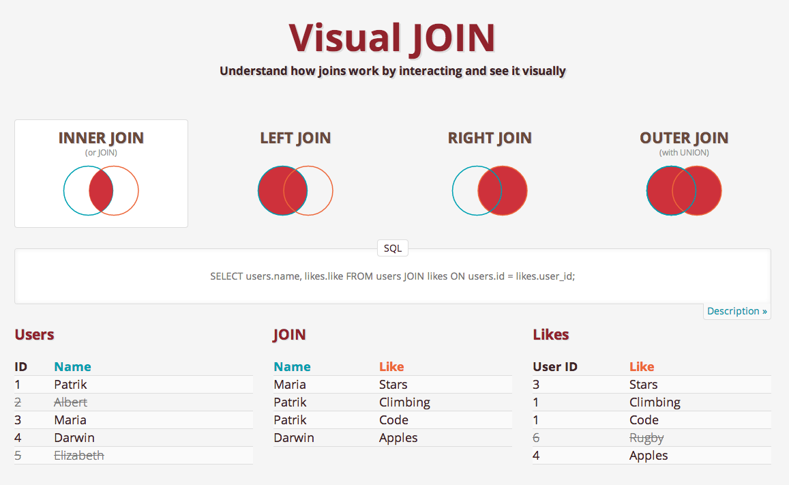

# Intermediate

## Aggregate Function

### COUNT
1. 모든 ROW의 수 세기
```SQL
SELECT COUNT(*) 
  FROM (table1)
```
- `COUNT(1)`도 `COUNT(*)`과 동일하다.
- 어떤 ROW에 결측치가 있더라도 해당 값 포함됨

1. (Null 값 제외한) 특정 Column의 수 세기 : 
```SQL
SELECT COUNT(column1)
  FROM (table1)
```

- `COUNT()`는 단순히 ROW의 수만을 셈 : 고유값을 세는 함수는 뒤에서 다룸.
- `AS`를 이용해 새로운 COLUMN으로 조회할 수도 있음.
  - 주의) 기존 column들과 **동시에 조회할 수 없음**
  - 대신 `Aggregation Function`끼리는 동시 조회 가능함

### SUM
- 어떤 **열**의 값들을 다 더함
- 참고) 행 방향으로 연산을 하고 싶다면, `BASIC`에서 다룬 단순한 연산을 이용하면 됨 ex) `colA + colB AS colC`

### MIN & MAX
- 숫자가 아닌 데이터 타입에도 적용 가능함
  - `MIN` : 가장 작은 숫자, 이른 날짜, a에 가까운 알파벳
  - `MAX`는 그 반대겠죠?

### AVG
- 몇 가지 제한 사항이 있음
1. **수치형에만 사용** 가능
2. **`null`값을 완전히 무시**함
- 따라서 사전에 결측치를 처리하긴 해야 함
```SQL
SELECT AVG(col1)
  FROM table1
 WHERE col1 IS NOT NULL -- 있든 없든 같은 결과를 낸다
```

## GROUP BY
- `Aggregation Function`은 모든 테이블에 대해 적용됨
- 근데 테이블의 일부에만 연산을 가할 상황이 있음
- 이 때 쓰는게 `GROUP BY`임
- `GROUP BY`는 데이터를 그룹으로 나누고, 서로 독립된 상황을 만듦
```SQL
SELECT year,
       month,
       COUNT(*) AS count
  FROM tutorial.aapl_historical_stock_price
 GROUP BY year, month
```
- 어떤 연도가 몇 개의 ROW를 갖는지 나눠서 보여줌
- `GROUP BY`를 쓰면 원본 COLUMN과 `AGG FUNC`을 함께 나타낼 수 있다.
- `GROUP BY` 뒤에 오는 COLUMN도 여러 개 지정할 수 있음
- 보면 알겠지만 `GROUP BY`에 쓰인 column은 `SELECT`문에도 들어감
-------------------
- 예제 : 연, 월을 오름차순으로 정렬
```SQL
SELECT year,
       month,
       SUM(volume) AS SUM_VOLUME
  FROM tutorial.aapl_historical_stock_price
 GROUP BY year, month
 ORDER BY year, month
```
--------------------
- Column의 순서를 안다면 1, 2 식으로 집어넣을 수 있으나 모든 SQL에 적용 가능한 것은 아니다.
- `GROUP BY`에 들어가는 열의 순서는 상관 없다. 그러나 `ORDER BY`에 들어가는 열의 순서는 상관 있다.
  - 위 예제는 `2000년 1월, 2000년 2월, ...` 순으로 정렬된다.
  - 그러나 `ORDER BY`가 `month, year`로 바뀐다면 `2000년 1월, 2001년 1월, 2002년 1월, ...`순으로 바뀐다.
- LIMIT과 함께 쓸 경우
  - LIMIT은 표시되는 데이터의 수에 제한을 걸기 때문에, 만약 고유값의 수가 100개가 넘는다면 정보의 일부분은 표시되지 않을 것임
  - 대충 그런 상황 조심하라는 얘기임

----------
예제2) 1년의 하루 평균 주식 가격 변화량
```SQL
SELECT year,
       AVG(close - open) AS avg_daily_change
  FROM tutorial.aapl_historical_stock_price
 GROUP BY year
 ORDER BY year
```
예제3) 매 해 매 달 주식의 최저가와 최고가
```SQL
SELECT year, 
       month,
       MAX(high) as monthly_high,
       MIN(low) as monthly_low
  FROM tutorial.aapl_historical_stock_price
 GROUP BY year, month
 ORDER BY year, month 
 ```
 ---------------

### 데이터 분석 언어로서의 SQL과 Python의 차이점
[원문](https://mode.com/blog/group-by-sql-python/?utm_medium=referral&utm_source=mode-site&utm_campaign=sql-tutorial)
- 여기선 결론 부분만 요약해둠
1. **복잡한 Grouping이 필요하지 않다면 SQL**을 이용, 한 언어로 계속 작업할 수 있다. 
2. 더 **복잡한 Grouping이 필요하다면 Python**으로 옮겨 작업하는 게 좋다.

## HAVING
- `Aggregate`된 Column에는 `WHERE`문이 먹히지 않는다.
- 이 때는 `HAVING`을 사용한다.
```SQL
SELECT year,
       month,
       MAX(high) AS month_high
  FROM tutorial.aapl_historical_stock_price
 GROUP BY year, month
HAVING MAX(high) > 400
 ORDER BY year, month
```
- 참고) `Subquery`에도 사용된다. 

### 쿼리문 순서
1. `SELECT`
2. `FROM`
3. `WHERE`
4. `GROUP BY`
5. `HAVING`
6. `ORDER BY`

## CASE
- SQL에서의 `if/then`문. 
- 항상 `CASE WHEN ... THEN ... (ELSE ...) END ...`식으로 사용한다.
```SQL
SELECT player_name,
       year,
       CASE WHEN year = 'SR' THEN 'yes'
            ELSE NULL END AS is_a_senior
            -- is_a_senior이라는 Column을 만든다
            -- 그 값은 year 값이 'SR'일 때 'yes',
            -- 아니라면 결측치로 남겨둔다
  FROM benn.college_football_players 
```
1. `CASE`문은 각 row에 대해 `year = 'SR'`을 체크한다
2. 조건문이 참이라면 `is_a_senior` 열에 `yes`값이 들어간다
    - 거짓이라면 null
3. 위 과정과 동시에 SQL은 `player_name`, `year` 열의 값들을 보여준다.

- 여러 조건문 넣기 
```SQL
SELECT player_name,
       weight,
       CASE WHEN weight > 250 THEN 'over 250'
            WHEN weight > 200 AND weight <= 250 THEN '201-250'
            WHEN weight > 175 AND weight <= 200 THEN '176-200'
            ELSE '175 or under' END AS weight_group
  FROM benn.college_football_players
```
- 조건의 중복을 피하게끔 코드를 짜 넣는게 좋다.
    - 즉 2번째 WHEN 문은 사실 `weight > 200`만 남겨도 동일하게 작동한다. `weight > 250`문에서 조건들이 걸러졌기 때문이다.
    - 그러나 **보는 사람이 명료하게 알 수 있게 쿼리를 짜 넣는 것이 중요**하다.
- `WHEN` 문 내부에는 `AND/OR`문을 넣을 수 있음.
---------------
- 예제 진행 중 결측치 데이터 처리
```SQL
SELECT max(height), min(height), avg(height)
  FROM benn.college_football_players 
 WHERE height != 0 
  -- 이거 있을 때 83, 57, 73.27
  -- 이거 없을 때 83, 0, 72.67
```
- `SELECT`문은 마지막에 실행되므로, `WHERE`문에서 결측치 값은 제거하고 데이터를 처리했다. 
--------------------
### CASE with AGG FUNC.
어떤 조건을 만족하는 열만을 세기
```SQL
SELECT CASE WHEN year = 'FR' THEN 'FR'
            ELSE 'Not FR' END AS year_group,
            COUNT(1) AS count
  FROM benn.college_football_players
 GROUP BY year_group
```
- `GROUP BY`문을 빼면 작동하지 않음
  - 일반 COLUMN과 `AGG FUNC`이 같이 들어가기 때문임
  - 이 때는 `SELECT`에 있는 조건문을 그대로 같이 써주면 된다.
- 위 쿼리는 `FR`과 `Not FR`에 대한 `COUNT` 결과를 같이 보여준다.
- `CASE ~ END`까지를 `GROUP BY` 문에 복사해도 똑같이 작동한다. 근데 굳이 그렇게 길게 쿼리를 작성할 필요가 없겠죠?
- `SELECT`문의 `CASE`가 맨 앞에 온다면 `GROUP BY 1`로도 가능하다.
  - 근데 명시적으로 작성해놓는 게 더 좋을 것 같다. 
```SQL
SELECT COUNT(1) AS fr_count
  FROM benn.college_football_players
 WHERE year = 'FR'
```
- 이런 식으로 `FR`과 `Not FR`을 각각 돌려 count 값을 얻을 수 있지만, 한 번에 1개의 값 밖에 얻을 수 없다. 

CASE 문 결과를 맨 앞에 넣기
```sql
SELECT CASE WHEN year = 'FR' THEN 'FR'
            WHEN year = 'SO' THEN 'SO'
            WHEN year = 'JR' THEN 'JR'
            WHEN year = 'SR' THEN 'SR'
            ELSE 'No Year Data' END AS year_group,
            *
  FROM benn.college_football_players
```
- *을 빼고 AGG FUNC을 넣고, GROUP BY를 넣을 수 있을 것이다.  

AGG 함수 내에 CASE 넣기(`피벗 테이블`)
```SQL
SELECT CASE WHEN year = 'FR' THEN 'FR'
            WHEN year = 'SO' THEN 'SO'
            WHEN year = 'JR' THEN 'JR'
            WHEN year = 'SR' THEN 'SR'
            ELSE 'No Year Data' END AS year_group,
            COUNT(1) AS count
  FROM benn.college_football_players
 GROUP BY 1
 ```
 - 결과 `year_group` 열에 `FR, SO, JR, SR, No Year Data` 값이 있을 거고 오른쪽의 `count` 열에 각 항목의 갯수가 있을 것이다.

```SQL
SELECT COUNT(CASE WHEN year = 'FR' THEN 1 ELSE NULL END) AS fr_count,
       COUNT(CASE WHEN year = 'SO' THEN 1 ELSE NULL END) AS so_count,
       COUNT(CASE WHEN year = 'JR' THEN 1 ELSE NULL END) AS jr_count,
       COUNT(CASE WHEN year = 'SR' THEN 1 ELSE NULL END) AS sr_count
  FROM benn.college_football_players
```
- **AGG 함수 내에 CASE문을 넣으면**, 4개의 열(`fr_count, so_count, jr_count, sr_count`)이 생기고 1개의 행에 각 count값이 들어가게 된다. 

----------------------
예제1 : 각 주(state)에 대해 전체 선수의 수와 연차 별 선수의 수를 나타내라.
(정렬은 전체 선수 수가 많은 순서대로 하라)
```SQL
SELECT state,
       COUNT(1) as total_count,
       COUNT(CASE WHEN year = 'FR' THEN 1 END) AS fr_count,
       COUNT(CASE WHEN year = 'SO' THEN 1 END) AS so_count,
       COUNT(CASE WHEN year = 'JR' THEN 1 END) AS jr_count,
       COUNT(CASE WHEN year = 'SR' THEN 1 END) AS sr_count
  FROM benn.college_football_players
 GROUP BY state
 ORDER BY total_count DESC 
```
예제2 : 이름이 A부터 M까지 시작하는 학교의 선수 수와, N부터 Z까지로 시작하는 학교의 선수 수를 나타내라
```SQL
SELECT CASE WHEN school_name < 'N' THEN 'A-M'
            WHEN school_name >= 'N' THEN 'N-Z'
            END AS name_group,
            count(1) AS number_of_players
  FROM benn.college_football_players
 GROUP BY name_group
```
- 문자 검색 조건이 깔끔하니 참고해두자.
----------------------------
## DISTINCT
- SELECT문에서만 쓸 수 있고, 각 COLUMN의 고유값을 찾는다.
- 당연히 여러 COLUMN에 대해 쓸 수 있음.
- **새로운 데이터셋을 탐색할 때 유용**하다 : 자주 쓰임

Agg Func과의 조합
```sql
SELECT COUNT(DISTINCT month) AS unique_months
  FROM tutorial.aapl_historical_stock_price
```
- 고유값 갯수 셀 때 `COUNT(DISTINCT ...)`를 이용한다.
- 참고 ) AGGREGATION에서 DISTINCT를 쓰는 건 쿼리 속도를 다소(`a bit`) 저하시킬 수 있다. 
---------------------------
## JOIN
- SQL의 힘은 **여러 테이블을 동시에 작업하는 것**에 있다.
- `관계형 데이터베이스` : `관계형` - 모든 테이블은 서로 연관되어 있다.
  - 공통된 식별자가 있으면 여러 테이블을 더 쉽게 묶을 수 있다. 
- 왜 관계형 테이블을 쓰는가?
```
EX) 트위터를 생각해보자. id와 "나에 관한 정보", 글, 날짜 등이 같이 저장된다. 내가 트윗을 할 때마다 해당 정보들이 새로운 row로 추가된다.
근데 "나에 관한 정보"를 바꿨다고 생각해보자 : 이전 row들에 있는 나에 관한 정보들이 모두 바뀌어야 한다. 5000개의 트윗을 썼다면 5000개의 데이터를 수정해야 한다. 여러 사람이 동시에 이용한다면 계산이 많이 들어갈 것이다. 
따라서 모든 유저의 정보를 별도의 테이블로 저장해두는 게 더 쉬운 방법이다. 유저의 정보가 바뀌더라도, 5000개의 row 대신 1개의 row만 수정하면 되기 때문이다. 
```
JOIN 사용하기
```SQL
SELECT teams.conference AS conference,
       AVG(players.weight) AS average_weight
  FROM benn.college_football_players players -- alias
  JOIN benn.college_football_teams teams
    ON teams.school_name = players.school_name
 GROUP BY teams.conference
 ORDER BY AVG(players.weight) DESC
```
1. `alias` 
  - `FROM (table1) name1 ...` : 이름을 간단하게 `alias`로 지정할 수 있음 (`AS`는 Column 이름을 정할 때 쓰였음. 구분하자)
  - 이렇게 `alias`로 지정된 테이블의 column에 접근하는 방법은 이전과 동일하다.
2. `FROM (table1) JOIN (table2) ON(table1.col1 = table2.col2`
  - 이 때 `table1`이 LEFT, `table2`이 RIGHT에 있다고 생각한다.

## INNER JOIN
- 
- `JOIN`의 디폴트 값이다. 
- `ON(col1 = col2)`에 해당되지 않는 값은 JOIN 결과에 포함되지 않는다.

## OUTER JOIN
- 
- 크게 `LEFT`, `RIGHT`, `FULL OUTER`이 있다
  - 기본적으로 모두 INNER(ON 조건을 만족하는 양쪽 테이블)은 모두 표시한다.
  - `LEFT` : `ON` 조건을 만족하지 않는 왼쪽 테이블의 ROW도 모두 표시한다. (`FROM`의 테이블)
  - `RIGHT` : 마찬가지. (`ON`의 테이블)
  - `FULL OUTER` : `LEFT` + `RIGHT`, 즉 ON 조건을 만족하지 않는 양쪽 테이블의 ROW 모두를 표시한다. 

### LEFT JOIN
```SQL
SELECT ...
  FROM (table1) 
  LEFT JOIN  (table2)
    ON table1.col1 = table2.col2
```
-----------
예제 1) INNER JOIN된 두 테이블에서, 각 테이블의 NULL이 아닌 ROW 수 세기
```SQL
-- join된 두 테이블의 null이 아닌 row 수 세기
SELECT COUNT(companies.permalink) AS  count_companies,
       COUNT(acquisitions.company_permalink) AS count_acquisitions
  FROM tutorial.crunchbase_companies companies
  JOIN tutorial.crunchbase_acquisitions acquisitions
    ON companies.permalink = acquisitions.company_permalink
```
예제 2) LEFT JOIN으로 바꿔서 그 차이를 비교해보자
- `ON`에 해당하는 COLUMN에 `COUNT()`를 적용했기 때문에 `NULL`이 아닌 ROW수가 나온다.
- `LEFT JOIN`의 경우 `FROM` 테이블의 모든 행이 들어갈 것이고, `JOIN`에 해당하는 행 중 `ON` 조건을 만족하는 행만이 표시되고, 나머지 데이터는 `NULL` 값이 되는 것.
예제 3) 고유한 회사의 수와, 고유한 승인된 회사의 수를 주 별로 표시하라. 정렬은 고유한 승인된 회사의 수를 내림차순으로 한다.
```SQL
SELECT companies.state_code,
      COUNT(DISTINCT companies.permalink) AS count_companies,
      COUNT(DISTINCT acquisitions.company_permalink) AS count_acquisitions
  FROM tutorial.crunchbase_companies companies
  LEFT JOIN tutorial.crunchbase_acquisitions acquisitions
    ON companies.permalink = acquisitions.company_permalink
 WHERE companies.state_code IS NOT NULL
 GROUP BY companies.state_code -- SELECT의 순서에 따라 1
 ORDER BY count_acquisitions DESC -- 3
```
- `GROUP BY`, `ORDER BY`는 각각 `1, 3`으로 표시해도 무방하다.(SELECT에서 그렇게 지정했기 때문에 이용 가능)
----------------------------
### RIGHT JOIN
- 똑같으니 패스. JOIN에 있는 모든 ROW가 들어간다는 차이만 있음.
### JOIN using WHERE or ON

1. `JOIN 하기 전에 필터링하는 방법`
```SQL
ON companies.permalink = acquisitions.company_permalink
AND acquisitions.company_permalink != '/company/1000memories'
```
 - `ON` 뒤에 `AND`를 붙여서 어느 한 쪽 테이블에만 조건문을 가할 수 있다. 

2. `JOIN 후 필터링하기` : WHERE문 이용함(동일)
```SQL
SELECT
  FROM
  JOIN
    ON
 WHERE
 GROUP BY
HAVING
 ORDER BY
 LIMIT
```
- JOIN은 FROM 다음에 온다고 생각하면 
- `SELECT - FROM - WHERE - GROUP BY - HAVING -  ORDER BY - LIMIT` 순서
-----------------------
예제 1) 회사 이름, 상태, 고유한 투자자의 수를 나타내는 쿼리를 작성하시오. 고유한 투자자의 수에 따라 정렬하고, 뉴욕에 있는 회사로만 한정함.
```sql
SELECT c.name AS company_name,
       c.status AS status,
       COUNT(DISTINCT i.investor_name) AS counts_investor
  FROM tutorial.crunchbase_companies c
  LEFT JOIN tutorial.crunchbase_investments i 
    ON c.permalink = i.company_permalink
 WHERE c.state_code = 'NY'
 GROUP BY 1, 2
 ORDER BY counts_investor DESC
```
헷갈린 것들 정리  
1. `AGG FUNCTION`이 등장했을 때 **일반 COLUMN은 GROUP BY로 묶어줘야 함** : 해당 일반 COLUMN들에 대한 수치를 AGG FUNCTION이 나타준다.
2. `LEFT JOIN`을 쓰는 이유 : 투자자가 없는 회사이더라도 표시할 필요는 있겠죠? 
  - `INNER JOIN`으로 가니까 쿼리가 무한 로딩임. 왜인지는 잘 모르겠다.  

예제 2) (말이 좀 헷갈림) 투자자를 그들이 투자한 기업 수를 내림차순하여 표시하시오. 투자자가 없는 회사도 포함할 것
```SQL
SELECT CASE WHEN investments.investor_name IS NULL THEN 'No Investors'
            ELSE investments.investor_name END AS investor,
       COUNT(DISTINCT companies.permalink) AS companies_invested_in
  FROM tutorial.crunchbase_companies companies
  LEFT JOIN tutorial.crunchbase_investments investments
    ON companies.permalink = investments.company_permalink
 GROUP BY 1
 ORDER BY 2 DESC
```
--------------------
### FULL OUTER JOIN 
- 보통 두 테이블 간의 중첩 정도를 이해하기 위해 집계(`AGG`)와 함께 사용됨.
```SQL
SELECT
  FROM
  FULL JOIN
    ON 
```
------------------
예제 : FULL OUTER JOIN 후 매칭된 ROW의 수와 매칭되지 않은 ROW의 수를 구하시오
```SQL
SELECT COUNT(CASE WHEN c.permalink = i1.company_permalink THEN 1 ELSE NULL END) AS matched,
       COUNT(CASE WHEN c.permalink IS NULL OR i1.company_permalink IS NULL THEN 1 END) AS unmatched
  FROM tutorial.crunchbase_companies c
  FULL JOIN tutorial.crunchbase_investments_part1 i1
    ON c.permalink = i1.company_permalink
```
- 어떤 **값을 세는 Column을 별도로 빼면 됨**
-----------------
## UNION
- `JOIN`이 양 옆으로 테이블을 붙인다면, `UNION`은 수직으로 테이블을 붙임
```SQL
SELECT *
  FROM (table1)

 UNION

SELECT *
  FROM (table2)
```
- 주의 : 1번째 테이블에 있는 row가 있고, 2번째 테이블에서 같은 row가 추가된다면 2번째 테이블의 row는 추가되지 않음 : 고유 row만 추가됨
  - 만약 고유 row가 아니라 테이블을 그대로 붙이고 싶다면, `UNION ALL`을 이용할 수 있다. 
- 주의2 : `UNION` 조건
  1. 두 테이블의 `column` 수는 동일해야 함
  2. 추가되는 테이블의 데이터 타입은 1번째 테이블의 데이터 타입 순서를 따라야 함
----------------
예제 
```SQL
-- 연습문제
-- 1번째 column은 어느 데이터셋에서 왔는지
-- 2번째는 company status
-- 3번째는 company 당 investor 수를 나타내는 column을 나타내시오
SELECT 'investments_part1' AS dataset_name,
       companies.status,
       COUNT(DISTINCT investments.investor_permalink) AS investors
  FROM tutorial.crunchbase_companies companies
  LEFT JOIN tutorial.crunchbase_investments_part1 investments
    ON companies.permalink = investments.company_permalink
 GROUP BY 1,2

 UNION ALL
 
 SELECT 'investments_part2' AS dataset_name,
       companies.status,
       COUNT(DISTINCT investments.investor_permalink) AS investors
  FROM tutorial.crunchbase_companies companies
  LEFT JOIN tutorial.crunchbase_investments_part2 investments
    ON companies.permalink = investments.company_permalink
 GROUP BY 1,2
```
1. JOIN이 된 상황이라면 COMPANY당 INVESTOR 수나, INVESTOR 당 COMPANY 수 모두 조회하기 굉장히 간단하다. 
```SQL
-- A1 당 B1의 수
SELECT A1,
       COUNT(B1) AS COL2
  ...

 GROUP BY A1
 ORDER BY COL2 DESC
----------------------------------
-- B1 당 A1의 수
SELECT B1,
       COUNT(A1) AS COL2
  ...

 GROUP BY B1,
 ORDER BY COL2 DESC
```
2. 만약 `UNION`하고 `ORDER BY`를 쓰고 싶다면?
```SQL
SELECT *
  FROM
( 
    SELECT 
      FROM

     UNION ALL

    SELECT
      FROM

     UNION ALL
     ...

)
ORDER BY column
```
- `()`로 UNION이 적용되는 열들을 감싼 뒤, 밖에서 한번 더 SELECT하는 방식을 쓴다고 한다.
--------------------
## 비교 연산자와 JOIN
```SQL
  FROM tutorial.crunchbase_companies companies
  LEFT JOIN tutorial.crunchbase_investments_part1 investments
    ON companies.permalink = investments.company_permalink
   AND investments.funded_year > companies.founded_year + 5
```
- `ON` 조건에는 다른 비교 연산자도 사용할 수 있다.
- `ON`문에 `WHERE`이 오는 것과의 차이점?
  - `ON`은 `JOIN`하기 전 한 쪽 테이블에 대해서만 수행됨
  - `WHERE`은 `JOIN`하고 나서 수행됨
```SQL
  FROM tutorial.crunchbase_companies companies
  LEFT JOIN tutorial.crunchbase_acquisitions acquisitions
    ON companies.permalink = acquisitions.company_permalink
   AND acquisitions.company_permalink != '/company/1000memories'
-- VS
  FROM tutorial.crunchbase_companies companies
  LEFT JOIN tutorial.crunchbase_acquisitions acquisitions
    ON companies.permalink = acquisitions.company_permalink
 WHERE acquisitions.company_permalink != '/company/1000memories'
    OR acquisitions.company_permalink IS NULL
```
- 전자의 `AND`문은 오른쪽 테이블 `acquisitions`에서만 수행됨 : 따라서 합쳐진 테이블에서, `companies`의 `1000memories`에 해당하는 데이터는 남지만 `acquisitions`의 `1000memories`에 해당하는 데이터는 필터링됨
- 한편 후자의 `WHERE`문은 합쳐진 테이블에서 수행됨 : 따라서 `1000memories`에 해당하는 row가 통째로 필터링됨.
  - 추가로, `WHERE`문에 의한 필터링 시 NULL 값을 가진 COLUMN이 있다면 자동으로 필터링 됨
  - 따라서 `WHERE문을 이용하고, NULL 값을 가진 데이터를 조회하고 싶다면 NULL 조건을 넣어줘야 함`

## 여러 키로 JOIN하기
여러 키로 JOIN해야 하는 이유가 있다.  
1. 정확도
2. 성능
   - SQL은 쿼리 속도를 높이기 위해 `인덱스`를 사용한다.
```SQL
SELECT companies.permalink,
       companies.name,
       investments.company_name,
       investments.company_permalink
  FROM tutorial.crunchbase_companies companies
  LEFT JOIN tutorial.crunchbase_investments_part1 investments
    ON companies.permalink = investments.company_permalink
   AND companies.name = investments.company_name
```
- 마지막 `AND`문은 있든 없든 위 쿼리가 수행하는 결과는 동일하다.
- 그러나 있는 게 더 빠르다 (근데 위 쿼리로는 큰 차이가 안 나타난다. 없는 게 빠를 때도 있음)
  
## Self JOIN
- 자기 자신과 `JOIN`하는 게 유용할 때가 있다.
```SQL
SELECT  DISTINCT japan_investments.company_name,
      japan_investments.company_permalink
  FROM tutorial.crunchbase_investments_part1 japan_investments
  JOIN tutorial.crunchbase_investments_part1 gb_investments
    ON japan_investments.company_name = gb_investments.company_name
   AND gb_investments.investor_country_code = 'GBR'
   AND gb_investments.funded_at > japan_investments.funded_at
 WHERE japan_investments.investor_country_code = 'JPN'
 ORDER BY 1
 ```
 1. 한 테이블을 다른 `ALIAS`로 `JOIN`했음
 2. `JOIN`하기 전, 투자자 코드 `GBR`에 대한 필터링이 오른쪽 테이블에서 이뤄지고, 등호와 부등호 조건에 의한 필터링이 이뤄진다.
 3. `WHERE`문에 의해, 투자자 코드 `JPN`에 해당하는 데이터만 남는다.
 4. 왼쪽 테이블의 `company name`에 의한 정렬이 이뤄진다.