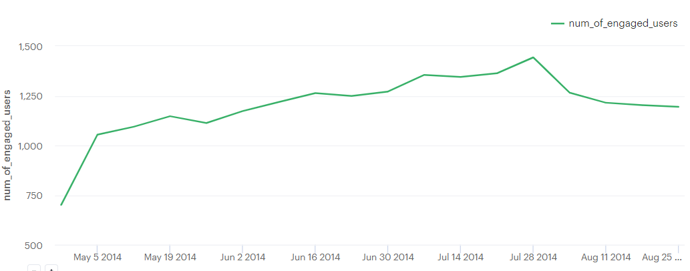
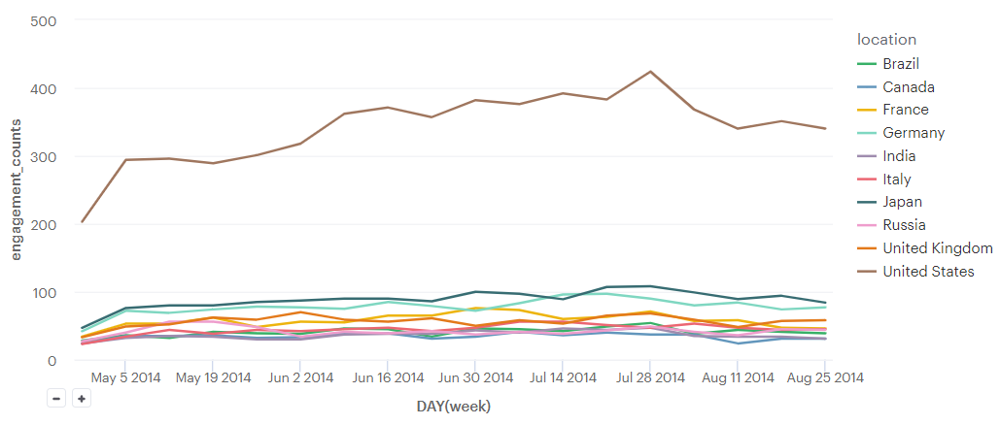
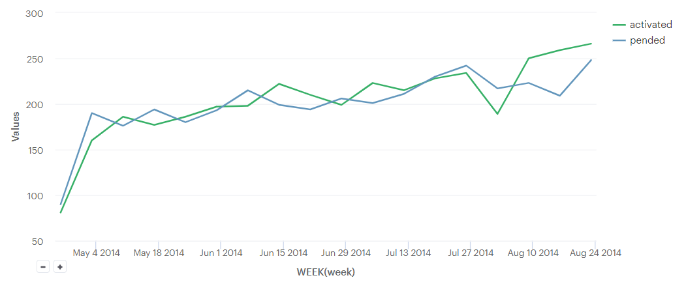
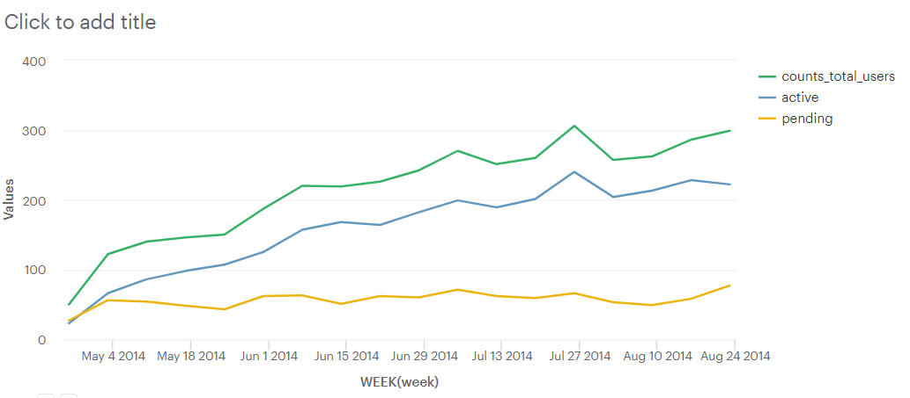
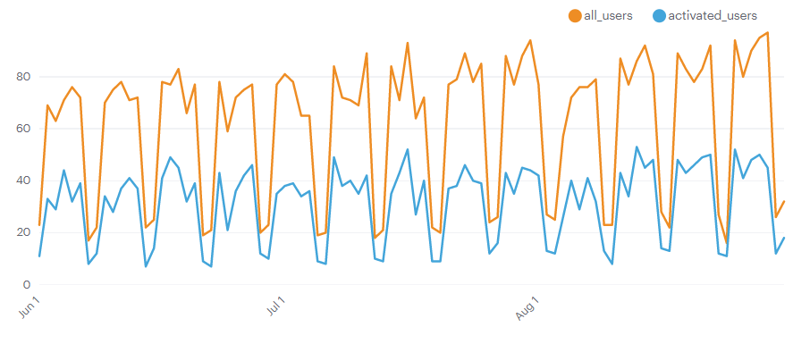
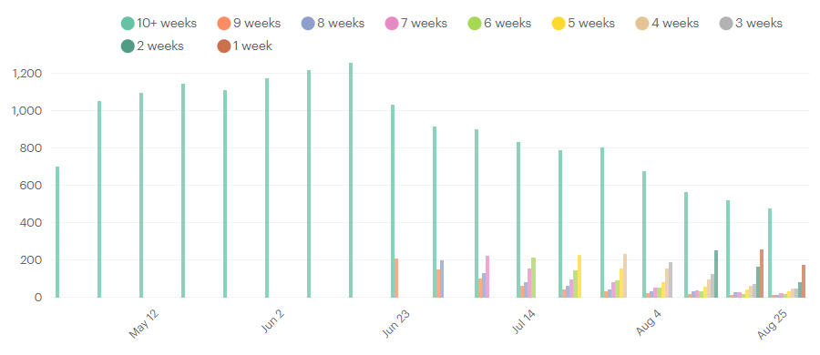
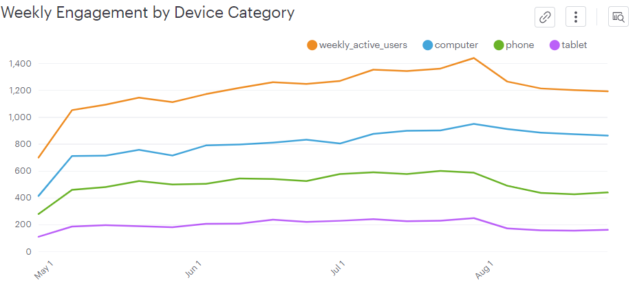
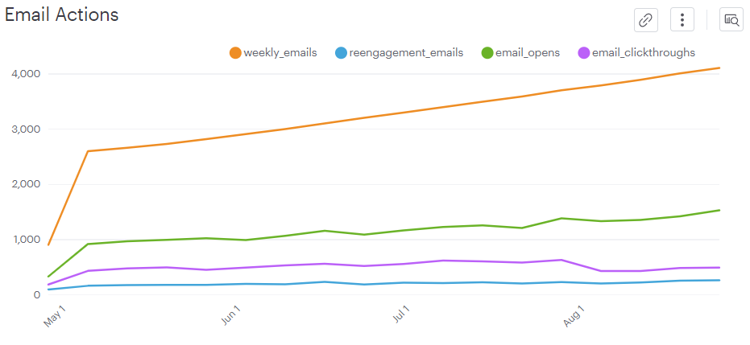
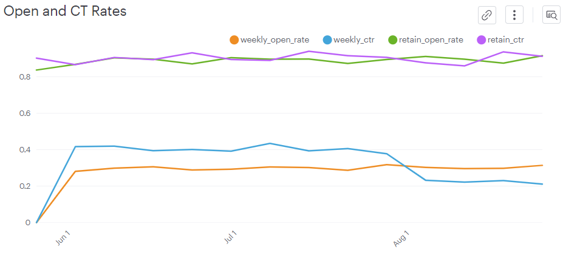

# Yammer Project
[실습 예제](https://mode.com/sql-tutorial/sql-business-analytics-training/)
- `Yammer` :  협업 툴임
  - 분석 팀의 목표 : 데이터를 이용한 더 나은 생산품 & 사업적 결정
- 시각화는 `Mode`에서 제공하는 툴을 이용함
- 실무와 효율에 관한 이야기들도 있으니 살펴보면 유용할 것이다

## 1. 사용자 참여`User Engagement`의 감소 조사
### 1. 매 주 참여(`Engagement`)하는 유저의 수 추이 파악
```sql
SELECT DATE_TRUNC('week', occurred_at) AS week,
       COUNT(DISTINCT user_id) AS num_of_engaged_users
  FROM tutorial.yammer_events 
 WHERE event_type = 'engagement'
 GROUP BY 1
 ORDER BY 1 desc
```

* **중요 : 더 깊게 들어가기 전에, 유저 감소의 가능한 원인을 생각해보자(가설을 세우라는 것!)**
    - 앞으로 할 일은 이 가설을 검증해보는 것이 될 것이다
    - **가설을 잘 세우는 건 중요**함 : **데이터를 살펴보는 시간을 줄일 수 있기 때문**이다. 
    - 물론 **정답은 없음** : 브레인스토밍으로 가능한 경우의 수들을 뽑아내는 것
* 또한 위 차트가 보여주는 정보와 보여주지 않는 정보를 명확히 알 필요도 있다.
```
1. 왜 유독 8월에 떨어졌는가 -> 국가나 지역별로 검증할 필요도 있을 것 같음
2. 신제품의 출시 여부도 영향이 있을 것이다 : 8월이 신제품 비수기일 수도 있고?
그 외엔 테이블에 대해 알고 있는 게 많이 없어서 잘 몰?루겠는데..
//
튜토리얼에서 생각한 것들은 아래와 같다
1. 휴일(증명 : 특정 국가의 참여만이 낮아졌다면 뒷받침할 근거가 됨)
2. 어플리케이션 손상 가능성(예를 들면 회원 가입이 막혔다면 유입이 줄어드니까 성장이 낮아질 수 있음)
3. 추적 코드 손상 가능성(새로운 데이터가 생기지 않는다면 ㅇㅋ)
4. 봇에 의한 비정상적인 트래픽
    - 봇의 패턴을 분석해야 하므로 결정하기가 어려워짐
5. 우리 사이트에 대한 트래픽 차단
6. 마케팅 이벤트
7. 데이터가 후져서
8. 크롤러의 변경
```
- 가능성이 많기 때문에 효율적으로 움직이는 게 중요하다. 시간 낭비 방지 대책으로는
    1. 경험 : 산업에서 몇 번 겪어보면 가장 빈번한 문제가 무엇인지 알 수 있음
    2. 의사소통 : 어떤 기간에 무슨 일이 있었는지 타인에게 물어보는 건 정보를 얻을 수 있는 가장 쉬운 방법임
    3. 속도 : 일부 가설은 더 쉽게 볼 수 있다 : 해봤거나, 데이터나 쿼리가 쉬운 경우임
        - 이런 테스트는 먼저 해보는 게 좋음
    4. 의존성 : 어떤 시나리오를 테스트 했을 때 이해하기 쉬워지는 다른 시나리오가 있다. 순서대로 할 것.

### 2. 가설 검증을 위한 데이터 탐색
- 이 예제에서는 4개의 테이블이 있다.
1. `Users`
- `user_id`, `created_at`, `state`, `activated_at`, `company_id`, `language`

2. `Events`
- `user_id`, `occurred_at`, `location`, `device`
- `event_type`
  - `signup_flow` : 유저의 인증 과정에서 참조한 것들
  - `engagement` : 가입 후 일반적인 상품과 관련된 것들 
- `event_name`
  - `create_user`
  - `enter_email`
  - `enter_info`
  - `complete_signup`
  - `home_page` : 홈페이지를 유저가 로드함
  - `like_message` : 좋아요
  - `login`
  - `search_autocomplete` : 자동완성 리스트에서 유저가 검색 결과를 선택함
  - `search_run` : 유저가 탐색 쿼리를 돌린 뒤 결과를 받음
  - `search_click_result_X` : 검색 결과 `X = 1~10` 중 `X`를 선택함
  - `send_message` : 메시지 게시
  - `view_inbox`
3. `Email Events`
- `user_id`, `occurred_at`
- `action`
  - `sent_weekly_digest`
  - `email_open`
  - `email_clickthrough` : 이메일 내의 링크 클릭
4. `Rollup Periods`
- 연속된 **시계열을 만들기 위한 테이블**. 
- `INTERVAL` 함수가 있지만 시계열에서 `rolling time`을 만들기 위해 사용되는 방법으로 쉬워서 자주 사용됨.

---------------------------
### 3. 위 가설들로 직접 탐색해볼 것
1. 국가 별 `Engagement` 추이
1) 모든 국가를 보는 게 좋은 방법은 아닌 것 같아서, 유저 수가 많은 상위 10개 국가에 대해 조사
    - 근데 유저의 국적을 추적할 방법이 없음(사용 언어 뿐)
    - 그나마 기업의 국적을 추적하는 방법을 생각했는데, 다국적 기업일 수도 있음(실제로 회사는 인도인데 사용 언어는 독일어, 한국어, 영어, 아랍어 등 다양하게 나옴) 
2) 지난 1년간 `engagement`에 관여한 아이디가 가장 많은 국적을 조사

```sql
SELECT sub2.location,
       sub2.week,
       sub2.engagement_counts,
       SUM(sub2.engagement_counts) OVER
       (PARTITION BY sub2.week ORDER BY sub2.week) AS summation_of_week
  FROM (
SELECT e.location AS location,
       DATE_TRUNC('week', occurred_at) AS WEEK,
       COUNT(DISTINCT e.user_id) AS engagement_counts
  FROM (
        SELECT location,
              COUNT(DISTINCT user_id) AS users_in_nations
          FROM tutorial.yammer_events
         WHERE occurred_at <= NOW() - INTERVAL '1 years'
         GROUP BY 1
         ORDER BY 2 DESC
         LIMIT 10
       ) sub
  JOIN tutorial.yammer_events e 
    ON sub.location = e.location 
 WHERE e.event_type = 'engagement'
 GROUP BY 1, 2  
      ) sub2
 ORDER BY 2 DESC
 ```

2. 유입이 줄었는가?
```sql
SELECT DATE_TRUNC('week', created_at) as week,
       COUNT(CASE WHEN state = 'pending' THEN 1 ELSE NULL END) as pended,
       COUNT(CASE WHEN state = 'active' THEN 1 ELSE NULL END) as activated
  FROM tutorial.yammer_users
 WHERE created_at >= date('2014-05-01')
 GROUP BY 1 
 ORDER BY 1
 ```
- 회원 가입이 막혔는지를 보는 쿼리.
- 

미국을 더 깊게 파보면
```sql
SELECT sub.week,
      COUNT(sub.user_id) as counts_total_users,
      COUNT(CASE WHEN sub.state = 'active' THEN 1 ELSE NULL END) AS active,
      COUNT(CASE WHEN sub.state = 'pending' THEN 1 ELSE NULL END) AS pending
  FROM( 
        SELECT DISTINCT DATE_TRUNC('week', e.occurred_at) AS week,
              e.user_id,
              u.state
          FROM tutorial.yammer_events e
          RIGHT JOIN tutorial.yammer_users u
            ON e.user_id = u.user_id
          AND u.created_at >= date('2014-05-01')
          AND location = 'United States'
      ) sub
  group by 1
  order by 1
```

- 가입했는데 승인이 안 된 `pending`의 증가세가 있지만, 이게 중요한 요소인가는 모르겠음.
- 한편 서브쿼리에 `engagement` 조건을 넣으면 (당연하게도) `pending = 0`이 뜸.
------------------------
### 4. 이 튜토리얼의 답지를 따라가보자
#### 1. 성장 : 신규 유저 유입 조회
```sql
SELECT DATE_TRUNC('day',created_at) AS day,
       COUNT(*) AS all_users,
       COUNT(CASE WHEN activated_at IS NOT NULL THEN u.user_id ELSE NULL END) AS activated_users
  FROM tutorial.yammer_users u
 WHERE created_at >= '2014-06-01'
   AND created_at < '2014-09-01'
 GROUP BY 1
 ORDER BY 1
 ```

- 일 단위로 가입자 수를 나타낸 그래프이다.
- 요일 단위로 추적했을 때 평일은 높고 주말은 낮은 추이를 보인다.
- 유저 수 감소에 중요한 요소는 아님을 알 수 있음 : 비슷, 혹은 증가하는 추이를 보이기 때문임

#### 2. 기존 유저가 감소했는가 조회
```sql
SELECT DATE_TRUNC('week',z.occurred_at) AS "week",
       AVG(z.age_at_event) AS "Average age during week",
       COUNT(DISTINCT CASE WHEN z.user_age > 70 THEN z.user_id ELSE NULL END) AS "10+ weeks",
       COUNT(DISTINCT CASE WHEN z.user_age < 70 AND z.user_age >= 63 THEN z.user_id ELSE NULL END) AS "9 weeks",
       COUNT(DISTINCT CASE WHEN z.user_age < 63 AND z.user_age >= 56 THEN z.user_id ELSE NULL END) AS "8 weeks",
       COUNT(DISTINCT CASE WHEN z.user_age < 56 AND z.user_age >= 49 THEN z.user_id ELSE NULL END) AS "7 weeks",
       COUNT(DISTINCT CASE WHEN z.user_age < 49 AND z.user_age >= 42 THEN z.user_id ELSE NULL END) AS "6 weeks",
       COUNT(DISTINCT CASE WHEN z.user_age < 42 AND z.user_age >= 35 THEN z.user_id ELSE NULL END) AS "5 weeks",
       COUNT(DISTINCT CASE WHEN z.user_age < 35 AND z.user_age >= 28 THEN z.user_id ELSE NULL END) AS "4 weeks",
       COUNT(DISTINCT CASE WHEN z.user_age < 28 AND z.user_age >= 21 THEN z.user_id ELSE NULL END) AS "3 weeks",
       COUNT(DISTINCT CASE WHEN z.user_age < 21 AND z.user_age >= 14 THEN z.user_id ELSE NULL END) AS "2 weeks",
       COUNT(DISTINCT CASE WHEN z.user_age < 14 AND z.user_age >= 7 THEN z.user_id ELSE NULL END) AS "1 week",
       COUNT(DISTINCT CASE WHEN z.user_age < 7 THEN z.user_id ELSE NULL END) AS "Less than a week"
  FROM (
        SELECT e.occurred_at,
               u.user_id,
               DATE_TRUNC('week',u.activated_at) AS activation_week,
               EXTRACT('day' FROM e.occurred_at - u.activated_at) AS age_at_event,
               EXTRACT('day' FROM '2014-09-01'::TIMESTAMP - u.activated_at) AS user_age
          FROM tutorial.yammer_users u
          JOIN tutorial.yammer_events e
            ON e.user_id = u.user_id
           AND e.event_type = 'engagement'
           AND e.event_name = 'login'
           AND e.occurred_at >= '2014-05-01'
           AND e.occurred_at < '2014-09-01'
         WHERE u.activated_at IS NOT NULL
       ) z

 GROUP BY 1
 ORDER BY 1
LIMIT 100
```

- 서브쿼리에서는 3가지 특성을 새로 만들었다.
  1. 계정을 활성화한 주
  2. 계정 활성화한 후 주문까지 걸린 기간(두 timestamp 간의 날짜 차이를 `day`로 나타냄)
  3. 계정의 나이(활성화 시점이 생일)
- 메인 쿼리에서는 서브쿼리의 정보를 활용해
    1. 주문한 계정들의 평균 나이
    2. 주문과 계정 나이에 대한 디테일
       - `DISTINCT CASE WHEN ~~` 문은 참고할 만하다.
- 얻을 수 있는 정보 : 10주 이상된 계정들의 `engagement` 수가 감소하고 있음.
- 따라서 **일시적인 사건들(일회성 급증, 순위 변경, 차단 등)에 의한 감소가 아님**을 알 수 있다. 
#### 3. 다양한 장치들에 대한 분석
```sql
SELECT DATE_TRUNC('week', occurred_at) AS week,
       COUNT(DISTINCT e.user_id) AS weekly_active_users,
       COUNT(DISTINCT CASE WHEN e.device IN ('macbook pro','lenovo thinkpad','macbook air','dell inspiron notebook',
          'asus chromebook','dell inspiron desktop','acer aspire notebook','hp pavilion desktop','acer aspire desktop','mac mini')
          THEN e.user_id ELSE NULL END) AS computer,
       COUNT(DISTINCT CASE WHEN e.device IN ('iphone 5','samsung galaxy s4','nexus 5','iphone 5s','iphone 4s','nokia lumia 635',
       'htc one','samsung galaxy note','amazon fire phone') THEN e.user_id ELSE NULL END) AS phone,
        COUNT(DISTINCT CASE WHEN e.device IN ('ipad air','nexus 7','ipad mini','nexus 10','kindle fire','windows surface',
        'samsumg galaxy tablet') THEN e.user_id ELSE NULL END) AS tablet
  FROM tutorial.yammer_events e
 WHERE e.event_type = 'engagement'
   AND e.event_name = 'login'
 GROUP BY 1
 ORDER BY 1
LIMIT 100
```

- `events` 테이블에 있는 장치들을 분류한 뒤 해당 값들을 `week`에 대해 집계한 결과다.
- 전반적으로 감소하는 추세지만, 특히 `phone`의 감소 추세를 볼 수 있다. 
- `engagement`에 대한 조사이므로, `phone`을 이용한 트래픽에 문제가 있음을 알 수 있다 : 이 시점에서 모바일 어플리케이션에 어떤 문제가 있는가를 주변인에게 물어볼 수 있을 것
- 또한 튕겨나간 사람들을 다시 유입할 요소를 생각할 수 있다 : 유저를 다시 유입하기 위해 안내 메일을 보내는 것도 방법이다. 

#### 4. 이메일 테이블 분석
```sql
SELECT DATE_TRUNC('week', occurred_at) AS week,
       COUNT(CASE WHEN e.action = 'sent_weekly_digest' THEN e.user_id ELSE NULL END) AS weekly_emails,
       COUNT(CASE WHEN e.action = 'sent_reengagement_email' THEN e.user_id ELSE NULL END) AS reengagement_emails,
       COUNT(CASE WHEN e.action = 'email_open' THEN e.user_id ELSE NULL END) AS email_opens,
       COUNT(CASE WHEN e.action = 'email_clickthrough' THEN e.user_id ELSE NULL END) AS email_clickthroughs
  FROM tutorial.yammer_emails e
 GROUP BY 1
 ORDER BY 1
```

- `clickthrough`이 낮아졌음 : 해당 항목은 이메일의 링크를 클릭했느냐 여부였음 -> 해당 항목에 문제가 생겼음을 알 수 있다.

#### 5. 이메일 열기 & Clickthrough 분석
```sql
SELECT week,
       weekly_opens/CASE WHEN weekly_emails = 0 THEN 1 ELSE weekly_emails END::FLOAT AS weekly_open_rate,
       weekly_ctr/CASE WHEN weekly_opens = 0 THEN 1 ELSE weekly_opens END::FLOAT AS weekly_ctr,
       retain_opens/CASE WHEN retain_emails = 0 THEN 1 ELSE retain_emails END::FLOAT AS retain_open_rate,
       retain_ctr/CASE WHEN retain_opens = 0 THEN 1 ELSE retain_opens END::FLOAT AS retain_ctr
  FROM (
SELECT DATE_TRUNC('week',e1.occurred_at) AS week,
       COUNT(CASE WHEN e1.action = 'sent_weekly_digest' THEN e1.user_id ELSE NULL END) AS weekly_emails,
       COUNT(CASE WHEN e1.action = 'sent_weekly_digest' THEN e2.user_id ELSE NULL END) AS weekly_opens,
       COUNT(CASE WHEN e1.action = 'sent_weekly_digest' THEN e3.user_id ELSE NULL END) AS weekly_ctr,
       COUNT(CASE WHEN e1.action = 'sent_reengagement_email' THEN e1.user_id ELSE NULL END) AS retain_emails,
       COUNT(CASE WHEN e1.action = 'sent_reengagement_email' THEN e2.user_id ELSE NULL END) AS retain_opens,
       COUNT(CASE WHEN e1.action = 'sent_reengagement_email' THEN e3.user_id ELSE NULL END) AS retain_ctr
  FROM tutorial.yammer_emails e1
  LEFT JOIN tutorial.yammer_emails e2
    ON e2.occurred_at >= e1.occurred_at
   AND e2.occurred_at < e1.occurred_at + INTERVAL '5 MINUTE'
   AND e2.user_id = e1.user_id
   AND e2.action = 'email_open'
  LEFT JOIN tutorial.yammer_emails e3
    ON e3.occurred_at >= e2.occurred_at
   AND e3.occurred_at < e2.occurred_at + INTERVAL '5 MINUTE'
   AND e3.user_id = e2.user_id
   AND e3.action = 'email_clickthrough'
 WHERE e1.occurred_at >= '2014-06-01'
   AND e1.occurred_at < '2014-09-01'
   AND e1.action IN ('sent_weekly_digest','sent_reengagement_email')
 GROUP BY 1
       ) a
 ORDER BY 1
```

쿼리 분석  
1. 서브쿼리
- 이메일 액션은 4가지가 있음
  1. `clickthrough` : 이메일의 링크를 눌렀는가
  2. `open` : 이메일을 열었는가
  3. `sent_weekly_digest` : 매 주 보내는 광고메일 보냄
  4. `sent_reengagement_email` : 서비스 재이용 권유 메일 보냄
- 즉 `e2`는 이메일을 받고 5분 이내에 열었을 때 해당이고
- `e3`은 이메일을 열고 5분 내에 링크를 눌렀는가에 대한 정보임
- 서브쿼리는 매 주에 대해 각 메일 항목(`digest`, `reengagement`)에 대해 `이메일이 보내졌는가`, `이메일을 열었는가`, `이메일의 링크로 들어갔는가` 3가지, 즉 6가지 column을 만들었다.
2. 메인쿼리
- 각 메일의 종류에 대해 보내진 메일을 열었는가, 연 메일의 링크를 들어갔는가에 대한 비율을 뽑았음
- `open / CASE WHEN emails = 0 THEN 1 ELSE emails END` 문이 이해가 안 갔는데, `(다음 과정) / (이전 과정)` 식으로 연관성이 있기 때문에 위처럼 쿼리를 짠 거임(메일이 가지 않았는데 여는 게 가능하지 않기 때문임)

- 위 사항을 통해 `weekly_ctr`, 즉 다이제스트 메일의 링크와 관련된 문제가 있음을 알 수 있다. 유저 참여가 감소한 기간 동안 해당 지표도 같이 하락했기 때문.

- 이거 하면서 든 생각은 **5분의 인터벌은 너무 짧지 않냐**는 건데, 이게 회사의 업무 관련한 db라는 걸 생각하면 합당한 가정일지도 모르겠다. 회사 생활을 해봤어야 알죠


#### 맺음말
- 위 조사를 통해 모바일 참여와 다이제스트 메일에 문제가 있음을 알 수 있다.
- 분석가가 문제가 있을 수 있는 부분을 파악한 뒤 관련 부서에 알려 그들이 어떤 부분에 집중해야 하는지를 빠른 시간에 파악하도록 할 수 있다. 

-----------------------------

## 2.